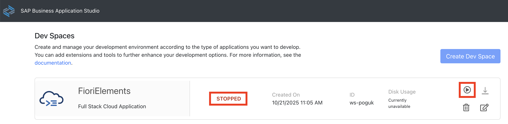
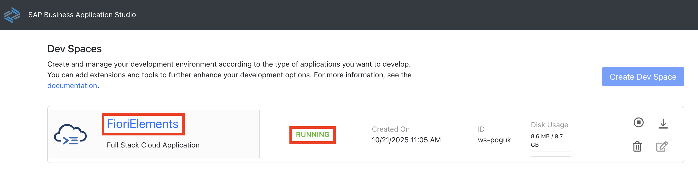
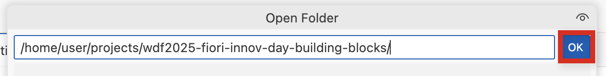

# Exercise 0 - Getting Started - Setting up your Development Environment

As a participant of the hands-on, you should already be set up with access to the SAP Business Application Studio landscape below which you can use as your development environment.

## Accessing SAP Business Application Studio

Navigate to https://lcapteched.eu10.build.cloud.sap/lobby

## Accessing the Dev Space Manager

On the SAP Build landing page, click button **Product Switch** in the top right corner and select **Dev Space Manager**. 

## Opening the Development Space

Make sure your development space has status running. If stopped, click the start button.   

Once running, click on the development space name to open it. This can take some time. 

Click **OK** in the popup window to accept the tracking settings in the newly created dev space.

## Open your project folder

Open the explorer icon from the left hand side:

And select the **Open Folder** button

Select the **projects** folder from the drop down

Then select **wdf2025-fiori-innov-day-building-blocks**.

Click **OK** and your window will reload

## Troubleshooting

In rare cases we have recently seen an issue with the watch feature in the SAP Business Application Studio. If you see an error message similar to the one below, please stop the watch process in the terminal by pressing `Ctrl + C` while the focus is in the terminal. Then run `npm start` in the terminal. When you follow the link in the terminal a page will open in a new tab and you can continue testing using `/sap.fe.traveldashboard/test/flp.html#app-preview`.

## Summary

With the setup procedure done, you now have completed:

- Access to SAP Business Application Studio
- Setting up the sample OData V4 service in SAP Business Application Studio

Continue to - [Exercise 1 - Generate an SAP Fiori elements app and build the first page](../ex1/README.md)
