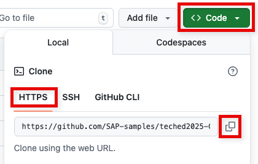
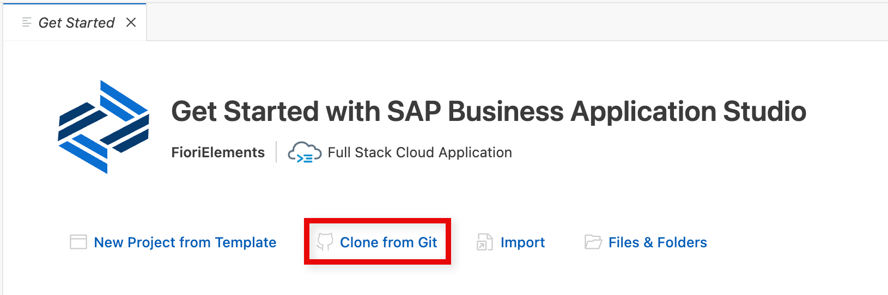
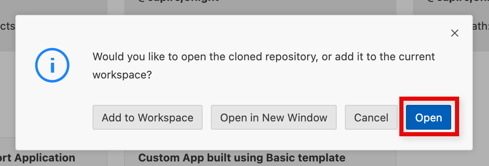
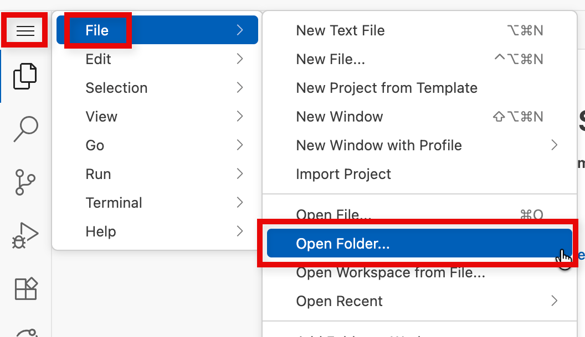
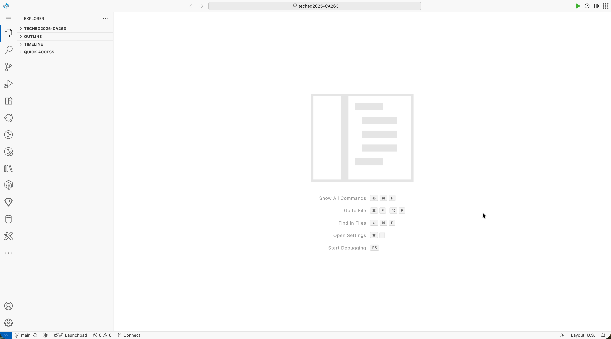
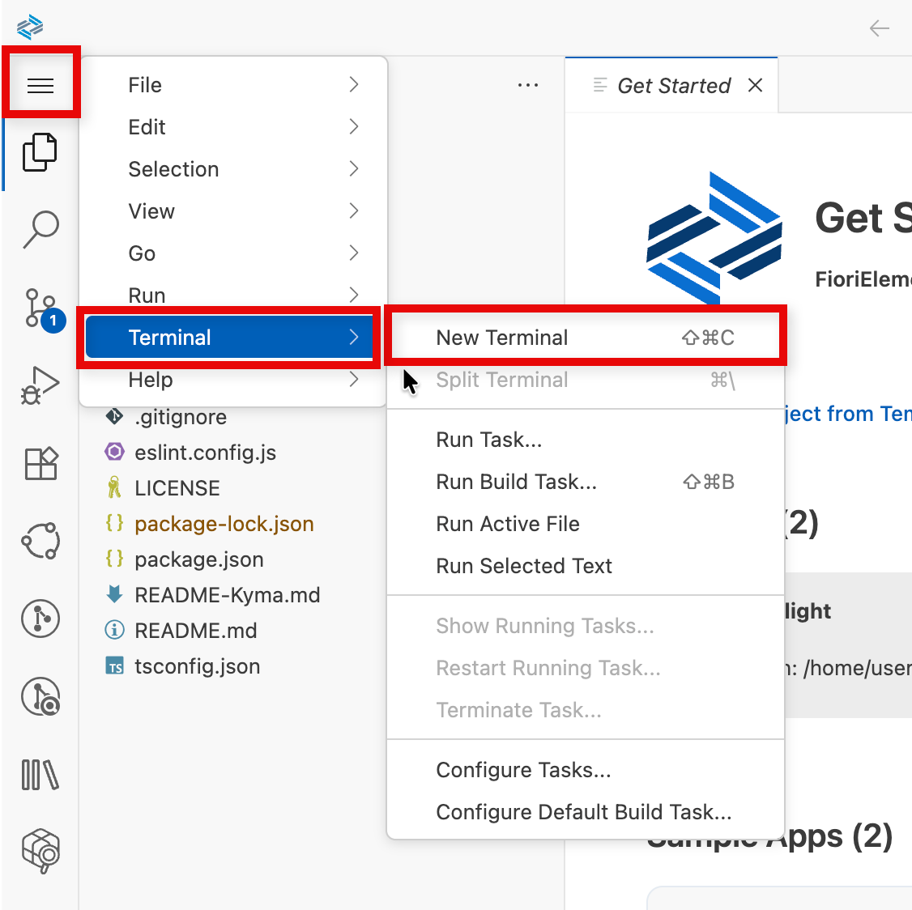
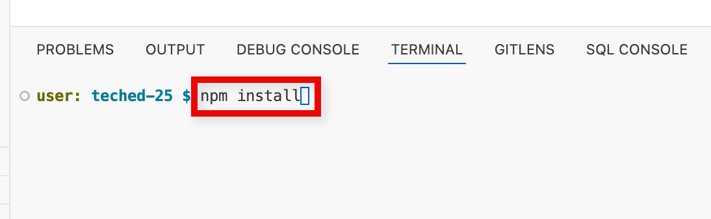

# Exercise 0 - Getting Started - Setting up your Development Environment

As a participant of the hands-on, you should already be set up with access to the SAP Business Application Studio landscape below which you can use as your development environment.

## Accessing SAP Business Application Studio

Navigate to https://lcapteched.eu10.build.cloud.sap/lobby

## Accessing the Dev Space Manager

On the SAP Build landing page, click button **Product Switch** in the top right corner and select **Dev Space Manager**.<br>


## Opening the Development Space

Make sure your development space has status running. If stopped, click the start button. <br><br>

Once running, click on the development space name to open it. This can take some time.<br>


Click **OK** in the popup window to accept the tracking settings in the newly created dev space.


## Open your project folder

Open the explorer icon from the left hand side:


And select the **Open Folder** button


Select the **projects** folder from the drop down


Click **OK** and your window will reload


## Getting the Sample Scenario

To get the sample project into your development space, you need to clone the GitHub repository.

Get the GitHub repository clone HTTPS URL from the repository's [landing page](https://github.com/SAP-samples/wdf2025-fiori-innov-day-building-blocks).
Click on button **Code**, then click the copy icon.



In the dev space, we will see a **Welcome Page**.\
Click on tile **Clone from Git**.



> [!TIP]
> Alternatively, you can go via menu **View → Find Command...** and search for command **git clone**.


Paste the repository link into the input field.

```
https://github.com/vinayhospete/WDF2025-fiori-innovation-day-building-blocks.git
```


If asked for a repository folder select the **projects** folder and click **Select Repository Location**.

When the cloning is finished, open the cloned repository.



> [!TIP]
> Alternatively, you can open a workspace via the file menu.
> 
> Select folder path **/home/user/projects/teched2025-CA263/** and click **OK**. This will restart SAP Business Application Studio.

In the **Explorer** pane on the left side of SAP Business Application Studio, you should see the workspace content.



The last step in this exercise is to install the node modules. Click on the menu button → ***Terminal*** → ***New Terminal***



Enter `npm install` and hit the ***Enter*** key.



The node modules will be installed. Then the project is ready to proceed to exercise 1.

In case you want to learn more about SAP CAP (Cloud Application Programming Model), head to its [official documentation](https://cap.cloud.sap/docs/).

## Summary

With the setup procedure done, you now have completed:

- Access to SAP Business Application Studio
- Setting up the sample OData V4 service in SAP Business Application Studio


Continue to - [Exercise 1 - Generate an SAP Fiori elements app and build the first page](../ex1/README.md)
