# Exercise 1 - Generate an SAP Fiori elements app and build the first page

In this exercise you generate an SAP Fiori elements application (OData V4) using the Application Generator provided by SAP Fiori tools ([documentation at help.sap.com](https://help.sap.com/docs/SAP_FIORI_tools?locale=en-US)) in SAP Business Application Studio. The app consumes the CAP service you cloned in the previous exercise and serves as a freestyle work area combining SAP Fiori elements building blocks (such as the building block-based table) with custom SAPUI5 XML views and integration cards. This illustrates how you can start from a standards-based, metadata-driven foundation and then extend it with free-form UI5 code for dashboards or specialized layouts while retaining reuse, consistency, and rapid development capabilities. You will:
- Generate a Custom Page–based SAP Fiori elements app bound to the Travel entity.
- Use building blocks to add a table quickly.
- Add annotations to enrich header and line-item presentation.
- Configure table features and actions through the Page Editor.
- Integrate SAPUI5 integration cards (List, News, Analytical) to create a compact analytical and navigational dashboard.
This sets the stage for blending declarative Fiori elements with freestyle UI5 to deliver flexible, enterprise-grade UX.

## Exercise 1.1 - Explore SAP Fiori development portal - Your One-Stop Shop

To help you choose the right path for your project, we introduced the [SAP Fiori development portal](https://ui5.sap.com/test-resources/sap/fe/core/fpmExplorer/index.html#/topic/introduction) where you can explore options, collaborate, and make informed decisions at every step. This portal aims to provide all project team members—business analysts, designers, developers, and users - with the information and tools they need to define a joint target picture and efficiently build SAP Fiori apps based on SAP Fiori elements for OData V4. 

Start with the "[Using the SAP Fiori Development Portal](https://ui5.sap.com/test-resources/sap/fe/core/fpmExplorer/index.html#/topic/introduction/portal)" page. It shows how to navigate the portal and find relevant information for your project role:

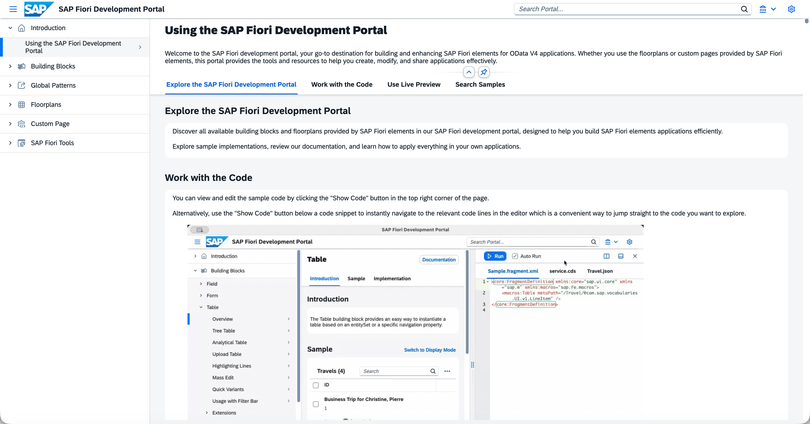

Portal chapters span: building blocks (tables, filters, charts etc.), global patterns (draft, navigation etc.), floorplans with extension points, and guidance for custom pages:

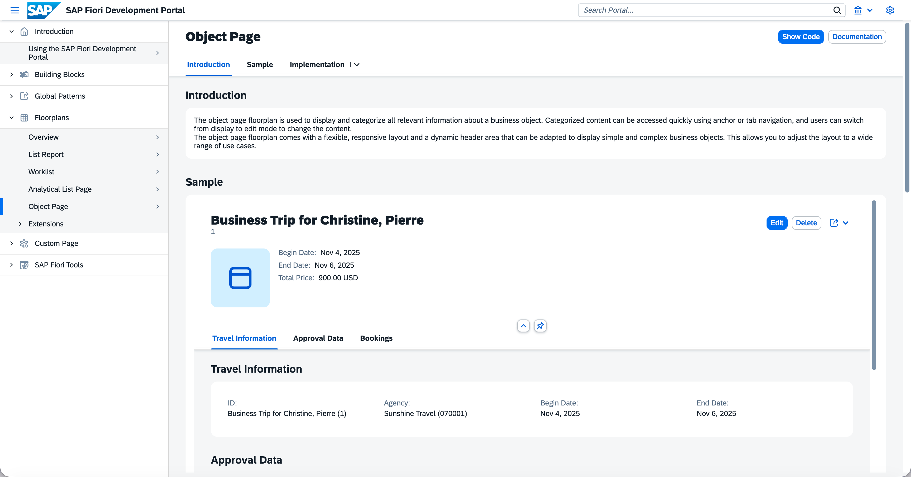


## Exercise 1.2 - Generate the app

In this step you use SAP Fiori tools - Application Generator to scaffold a new SAP Fiori elements application based on the Custom Page template. The wizard connects directly to your local CAP project, reads the service metadata, and lets you pick the main entity (Travel). This eliminates manual boilerplate and ensures the generated app is correctly wired to the OData V4 service from the start.

Navigate to **View → Command Palette** from the menu bar.


Search for **Fiori: Open Application Generator** and select it.


Select the **Custom Page** template and click **Next**.


For the **Data Source**, select the **Use a Local CAP Project** option.

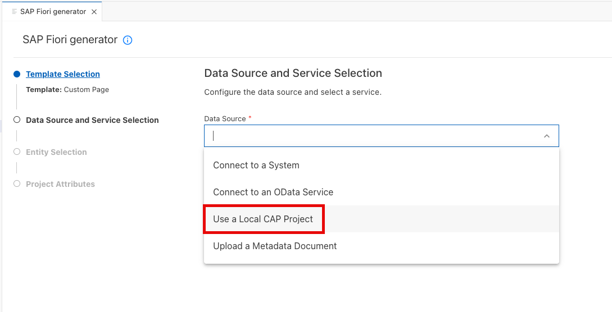

The Teched 2025 project details should be automatically entered. Click **Next**.

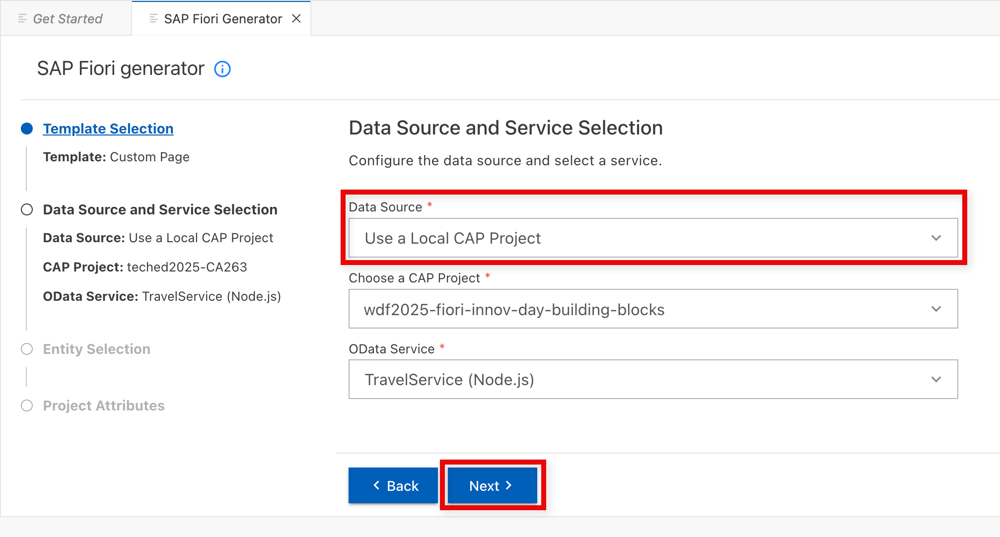

Under **Entity Selection** the **Main Entity** should be set to **Travel**. Click **Next**.

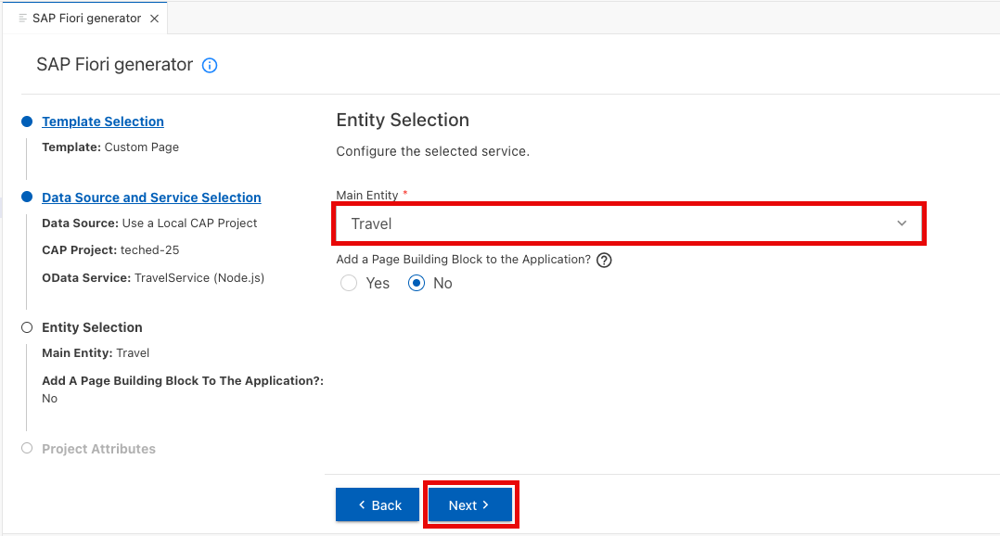

Enter the following project attributes:

- **Module name**: `traveldashboard`
- **Application Title**: `Travel Dashboard`
- **Application Namespace**: `sap.fe`
- **Description**: `Dashboard for Travel Agents`

Select **Yes** for **Enable TypeScript** and leave the remaining selections as they have been pre-configured. 

For the Minimum SAPUI5 Version the micro version 1.141.**X** doesn't matter. In the meantime SAPUI5 1.142.0 was released, you can also use this version.

Click **Finish**.

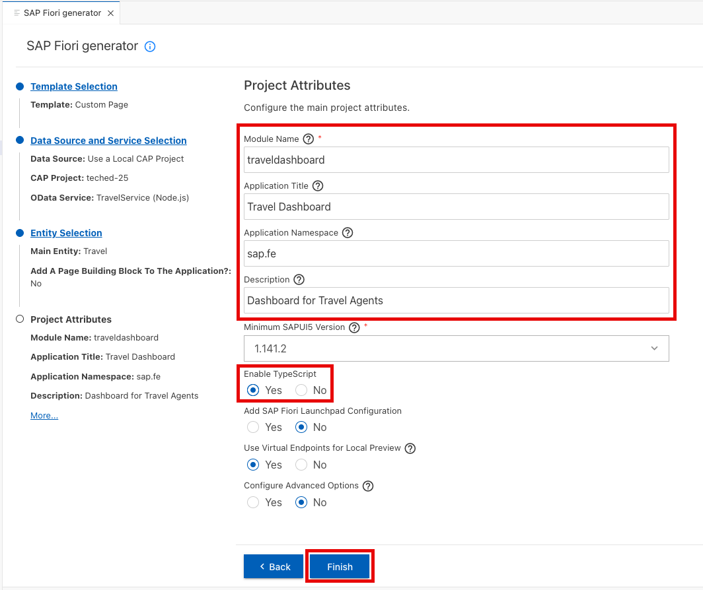

The project will be generated and added to your workspace. This process may take a few moments. Once finished the **Application Information** page will show up.

## Exercise 1.3 - Configure the custom page

Following app generation the **Application Information** page should open. Click the **Preview Application** button and choose the **watch-traveldashboard** script to run the app.


At this point the previewed application should appear blank aside from displaying the heading 'Main' as follows:

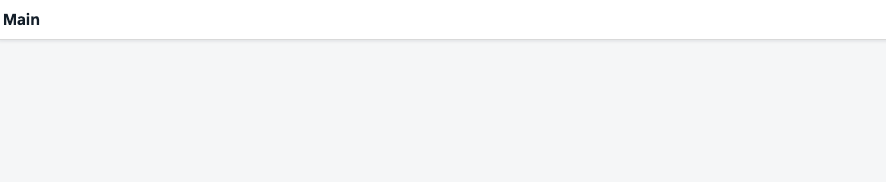

Return to the Application Information page to open the page map. Click the **Open Page Map** button.

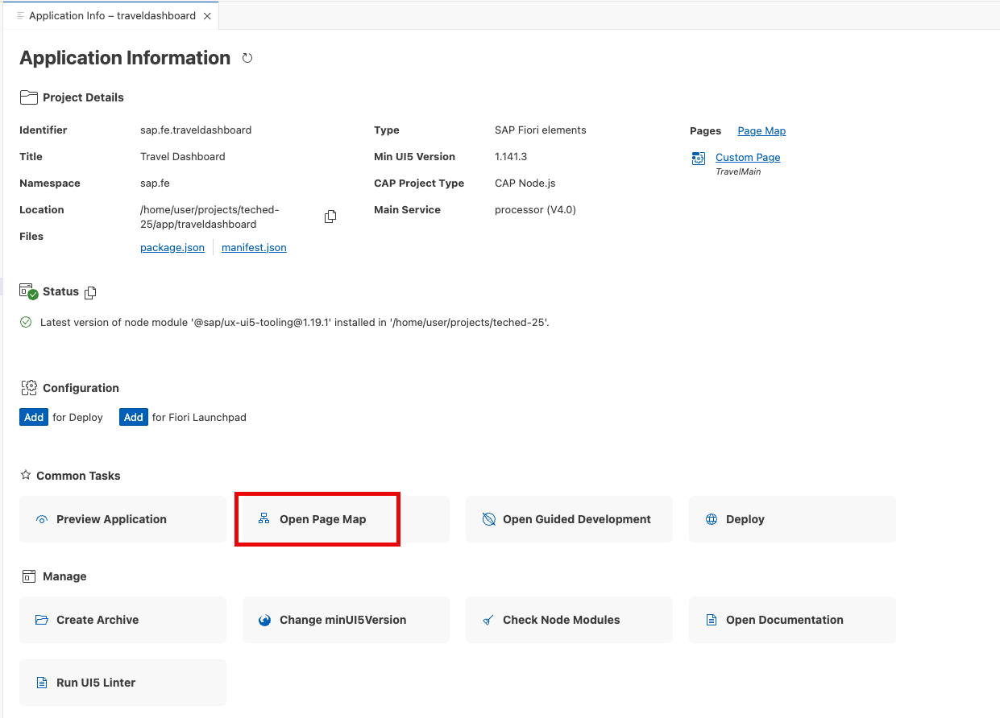

### Add a table building block

The SAP Fiori elements Table building block (`macros:Table`) renders a fully featured responsive table bound to an entity set or navigation collection using only service metadata and UI annotations. Pointing it at an entity (or a `UI.LineItem` collection) auto-wires data binding, column headers, semantic types and a rich tool bar. Out of the box you get: search, sorting, filtering, variant/personalization (P13n), multi-selection, Excel export, keyboard/accessibility support, and integration with actions. This keeps page code minimal while still allowing you to fine‑tune behavior declaratively in the Page Editor or via annotations.

In the Page Map, click the **Configure Page** icon (pencil) next to **Custom Page** to open the **Page Editor**.

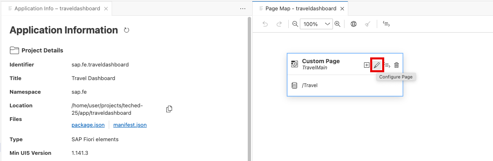

Click the **Add** icon (plus) next to **Building Blocks** and select the **Add Table** option.

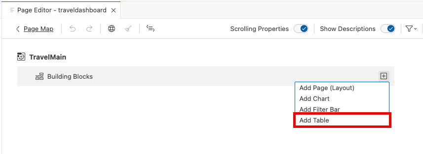

Ensure the following values are selected in the **Add Table** dialog and click **Add**:

- **Binding Context**: `Absolute`
- **Entity**: `Travel`
- **Aggregation Path**: `/mvc:View/Page/content`

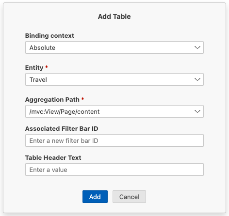

### Configure table columns

Time to add some basic columns to the table. Expand the Table dropdown, click the **Add** icon (plus) next to **Columns**, and click **Add Basic Columns**.

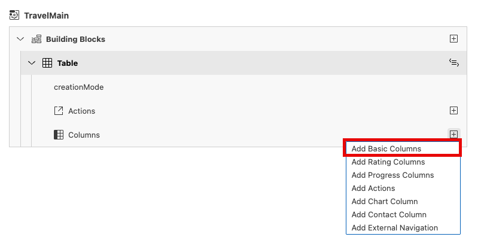

Select the following fields in the following order to be added as columns and click **Add**:

- `TravelID`
- `to_Agency_AgencyID`
- `to_Customer_CustomerID`
- `BeginDate`
- `TotalPrice`
- `TravelStatus_code`

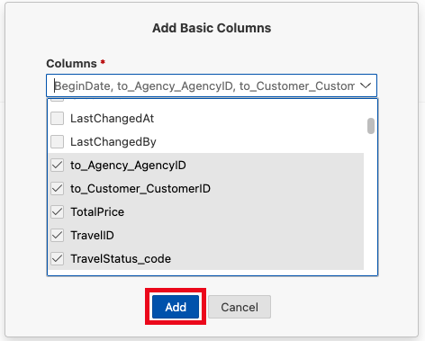

Open the previewed application browser tab/window. Refresh the page in case the page/table doesn't show up. The table should now be visible with the selected columns.

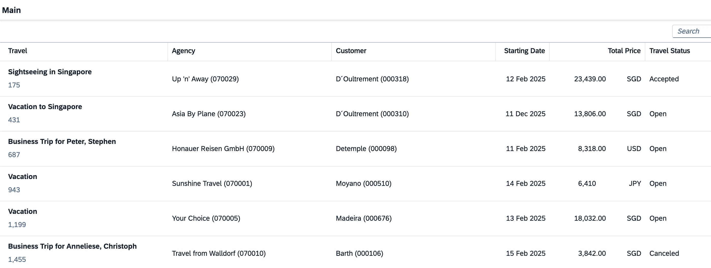

In the Page Editor, click the **Edit in Source Code** icon next to **Table** to view the generated XML code for the table.


## Exercise 1.4 - Add annotations for Travel

### Add Travel header information

The UI.HeaderInfo annotation supplies semantic header metadata (singular/plural type names plus key descriptive fields) for entities rendered in list reports, object pages, or reused building blocks (such as building block tables). Providing it improves table captions and object headers, making content recognizable and accessible. To see which annotations exist, you can refer to [github.com/SAP/odata-vocabularies](https://github.com/SAP/odata-vocabularies/tree/main) to explore SAP-defined annotations and [github.com/oasis-tcs/odata-vocabularies](https://github.com/oasis-tcs/odata-vocabularies) for annotations specified by Oasis, from the OData technical committee.

To enhance the travel table with header information, open the `app/traveldashboard/annotations.cds` file from the Explorer and add the following `UI.HeaderInfo` annotation, ensuring to separate it with a comma:

```
UI.HeaderInfo : {
    TypeName : 'Travel',
    TypeNamePlural : 'Travels',
    Description : {
        $Type : 'UI.DataField',
        Value : TravelID,
    },
    Title : {
        $Type : 'UI.DataField',
        Value : Description,
    },
}
```

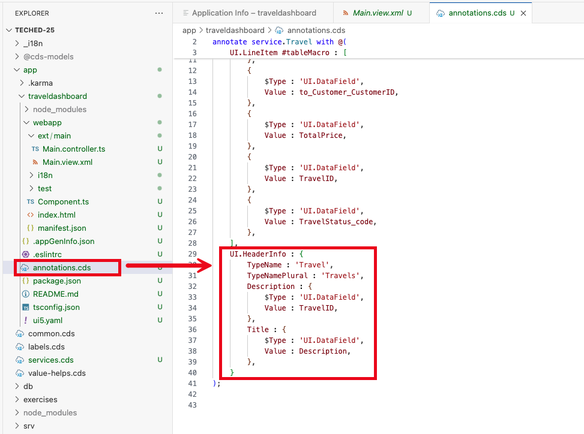

You'll see the title and description appear on the object page later. Save the file and return to the previewed application window. The travel table should now display header information as follows:

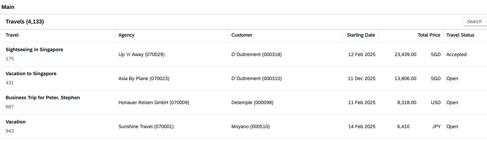

## Exercise 1.5 - Add annotations for Booking

Next we also want to surface related Booking data on the dashboard. To prepare for a second table we add Booking-specific annotations. The `UI.LineItem` annotation defines an ordered collection of `UI.DataField` entries (each pointing to a property or media/association) that the table building block turns into columns automatically — no manual XML column definitions needed. After annotating we can drop in another `macros:Table` bound to the Booking entity and it will render the specified columns (airline picture, ID, customer, carrier, flight date) along with the same built‑in table capabilities.

Add annotations for the Booking entity to configure its display. In the same `app/traveldashboard/annotations.cds` file, add the following annotation for the Booking service:

```
annotate service.Booking with @(
    UI.HeaderInfo: {
        TypeName: 'Booking',
        TypeNamePlural: 'Bookings',
        Title: { Value: 'BookingID' },
        Description: { Value: 'to_Customer_CustomerID' }
    },
    UI.LineItem: [
        {
            $Type : 'UI.DataField',
            Value : to_Carrier.AirlinePicURL,
        },
        {
            $Type : 'UI.DataField',
            Value : BookingID,
        },
        {
            $Type : 'UI.DataField',
            Value : to_Customer_CustomerID,
        },
        {
            $Type : 'UI.DataField',
            Value : to_Carrier_AirlineID,
        },
        {
            $Type : 'UI.DataField',
            Value : FlightDate,
        },
    ]
);
```

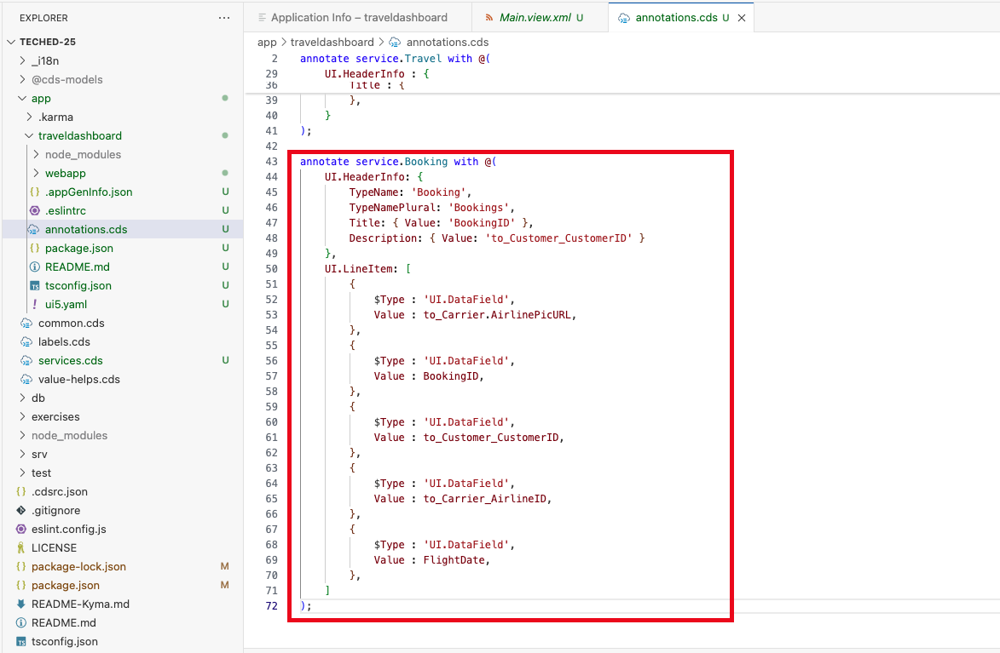

While you work in the CDS file, SAP Fiori tools offers code completion and suggestions.

Now we want to use a couple of layout controls of SAPUI5 to structure the page and make it responsive. Return to the Main.view.xml file located at `app/traveldashboard/ext/main/Main.view.xml` and replace all the existing XML with the following snippet.

```
<mvc:View xmlns:core="sap.ui.core" xmlns:l="sap.ui.layout" xmlns:f="sap.f" xmlns:mvc="sap.ui.core.mvc" xmlns="sap.m" xmlns:macros="sap.fe.macros" xmlns:html="http://www.w3.org/1999/xhtml" xmlns:card="sap.f.cards" xmlns:w="sap.ui.integration.widgets" controllerName="sap.fe.traveldashboard.ext.main.Main">
    <Page showHeader="false" title="Travel Agent Work Area" id="page">
        <content>
            <l:VerticalLayout width="100%" id="verticalLayout">
                <l:Grid containerQuery="true" id="grid">
                    <f:Card class="sapUiTinyMargin" id="travelCard">
                        <f:content>
                            <HBox width="100%" id="travelHBox">
                                <macros:Table id="travelTable" metaPath="/Travel/@com.sap.vocabularies.UI.v1.LineItem#tableMacro"/>
                            </HBox>
                        </f:content>
                        <f:layoutData>
                            <l:GridData span="XL6 L6 M12 S12" id="travelGridData"/>
                        </f:layoutData>
                    </f:Card>
                    <f:Card class="sapUiTinyMargin" id="bookingCard">
                        <f:content>
                            <HBox width="100%" id="bookingHBox">
                                <!-- Booking Table Building Block -->
                            </HBox>
                        </f:content>
                        <f:layoutData>
                            <l:GridData span="XL6 L6 M12 S12" id="bookingGridData"/>
                        </f:layoutData>
                    </f:Card>
                </l:Grid>
            </l:VerticalLayout>
        </content>
    </Page>
</mvc:View>
```

In a custom page one has the full flexibility to use and arrange SAPUI5 controls as needed. Here we use a grid layout to arrange two cards side by side on larger screens (travel table on the left, bookings table on the right) and stacked vertically on smaller screens.

Next, we will explore the table building block in the SAP Fiori Development Portal to learn how to add the building block into a custom page. Open the [SAP Fiori Development Portal](https://ui5.sap.com/test-resources/sap/fe/core/fpmExplorer/index.html#/buildingBlocks/table/tableDefault) and navigate to the **Building Block: Table** section:

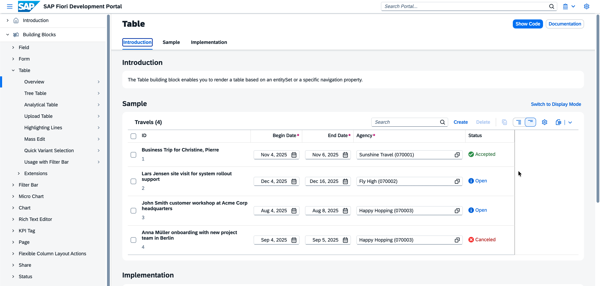

There are multiple table types available in the SAP Fiori elements table building block. Explore the different table types and their features in the portal like e.g. **Tree Table** and **Analytical Table**.

Add the following Table Building Block snippet inside the `<HBox>` (line 19) tags of the Booking Card in the `Main.view.xml` file to add the bookings table:

```
<macros:Table id="bookingsTable" readOnly="true" metaPath="/Booking/@com.sap.vocabularies.UI.v1.LineItem" />
```

The building block will use the UI.LineItem annotation we added earlier to determine which columns to show in the bookings table.

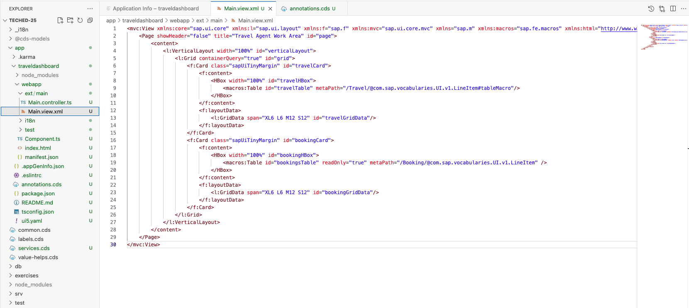

Open the previewed application window. The bookings table should now be visible alongside the travel table as follows:

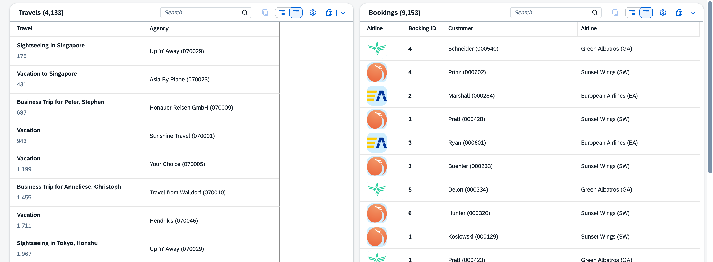

Explore the table features like searching, sorting, filtering, and personalization in both tables. These features are automatically enabled by the table building block based on the metadata and require no additional coding. 

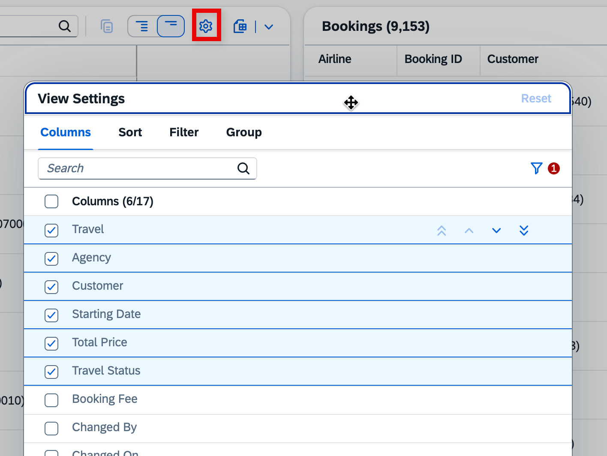

## Exercise 1.6 - Configure table toolbar features

SAP Fiori tools Page Editor exposes building block configuration in a declarative UI — allowing quick enable/disable of toolbar features (copy, export, paste), adaptation of selection or personalization options, and addition of bound or unbound actions without manual XML edits. This lowers effort and enforces consistency.

Return to the TravelMain Page Editor in your SAP Business Application Studio, and select the first Table Building Block to open its configuration.

> [!NOTE]
> If the Page Editor is not already open, you can access it by navigating to the Page Map and clicking the **Configure Page** icon (pencil) next to **Custom Page**.

Set **Disable Copy to Clipboard** to **True**, **Enable Export** to **False**, and **Enable Paste** to **False**.

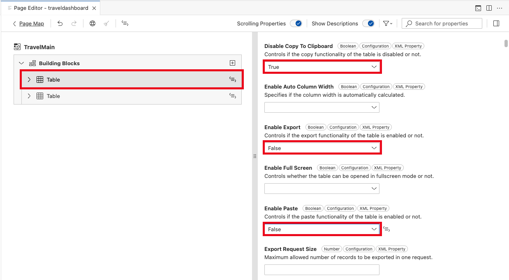

Apply the same configuration to the second Table Building Block for Bookings.

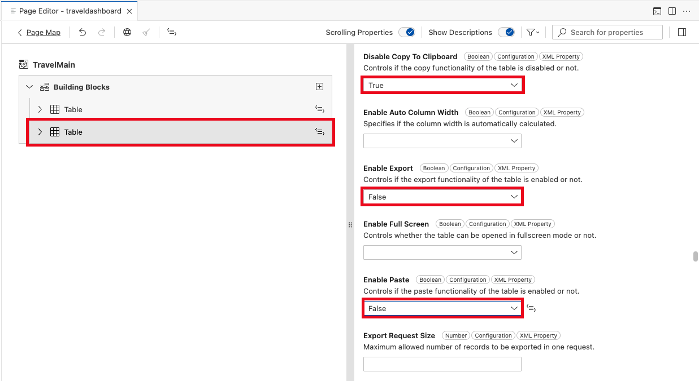

Return to the previewed application window. You should notice that the table toolbars now appear with fewer action buttons, as the copy, export, and paste functionalities have been disabled.

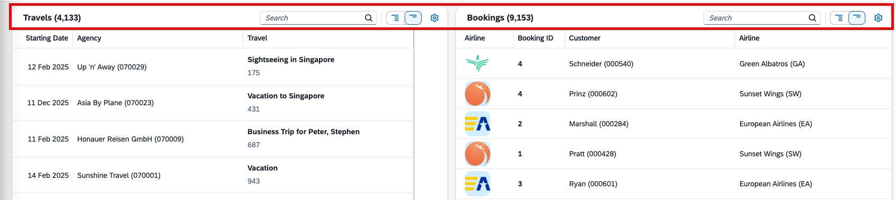

## Exercise 1.7 - Add a bound table action

Next, we will add an Action to the Travel table toolbar.

Click the **Add** icon (plus) next to **Actions** in the Travel Table Building Block, then click **Add Action**.

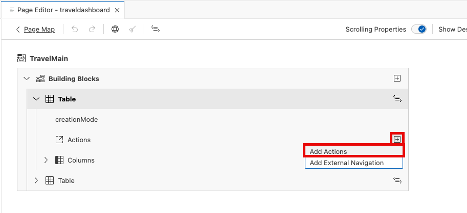

Select the `TravelService.deductDiscount` Action and click **Add**.

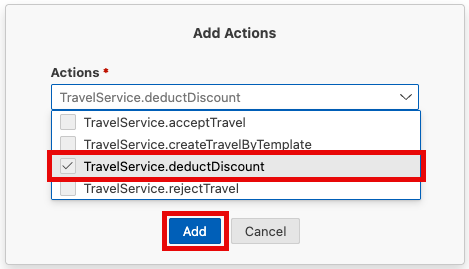

In the configuration pane, update the **Label** field to `Deduct Discount` for better readability and click **OK**.

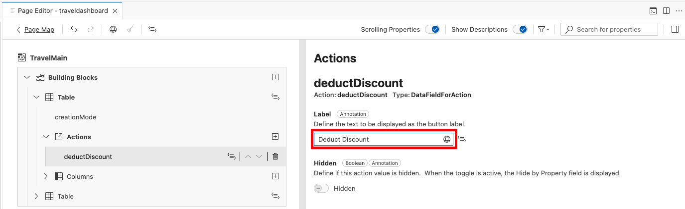

Refresh the preview window where the Deduct Discount action should now be visible in the Travel table toolbar as follows:

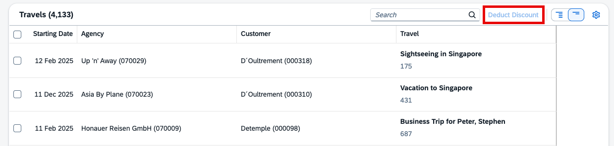

## Exercise 1.8 - Add SAPUI5 integration cards

SAPUI5 Integration Cards are lightweight UI components defined primarily by a manifest.json descriptor. They support multiple card types (List, Object, Analytical, etc.), data binding via JSON, OData requests, and action handling. Because they are metadata-driven, you can integrate them into a Fiori elements freestyle page by simply referencing the manifest file in a card widget tag. This enables rapid assembly of dashboard-like layouts.

Explore available types and configuration options using the [SAPUI5 Card Explorer](https://ui5.sap.com/test-resources/sap/ui/integration/demokit/cardExplorer/webapp/index.html):
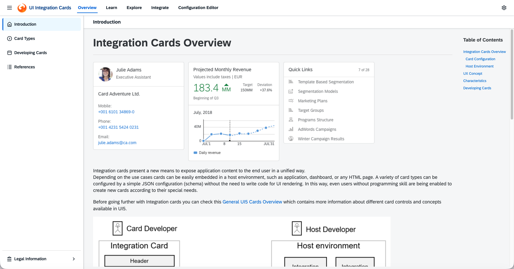

We'll now add a grid container to organize SAPUI5 integration cards in a responsive layout. Add the following GridContainer snippet to the Main.view.xml file before the existing grid:

```
<f:GridContainer class="sapUiSmallMargin" id="gridContainer">
	<f:layout>
		<f:GridContainerSettings rowSize="5rem" columnSize="5rem" gap="1rem" id="gridContainerSettings" />
	</f:layout>
	<f:layoutS>
		<f:GridContainerSettings rowSize="5rem" columnSize="5rem" gap="0.5rem" id="gridContainerSettingsS" />
	</f:layoutS>

</f:GridContainer>
```

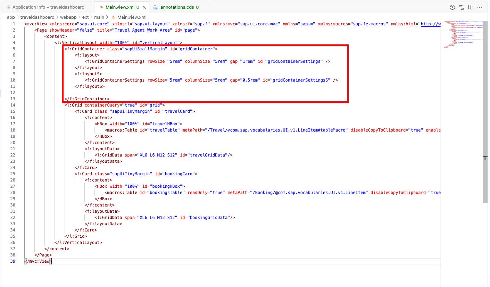

You will now create a List-type Integration Card (Quick Links). Its manifest supplies static JSON data with names and icons. Each item can navigate to tools or external resources; for this exercise URLs are intentionally left blank to keep focus on structure. In production you can populate actionable destinations (launchpad tiles, help pages, team sites).

Create a folder named `cards` within the `app/traveldashboard/ext` directory. Inside this folder, create a new JSON file called `quicklinks.json`.

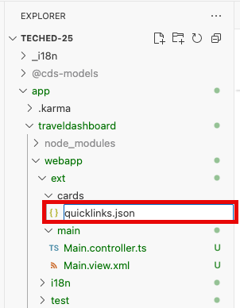

Populate the `quicklinks.json` file with the following content:

```
{
	"_version": "1.15.0",
	"sap.app": {
		"id": "traveldashboard.cards.quicklinks",
		"type": "card",
		"title": "Quick Links",
		"subTitle": "",
		"applicationVersion": {
			"version": "1.0.0"
		},
		"shortTitle": "Quick Links",
		"info": "Card displaying quick links",
		"description": "Card displaying quick links",
		"tags": {
			"keywords": [
				"Quick Links"
			]
		}
	},
	"sap.ui": {
		"technology": "UI5",
		"icons": {
			"icon": "sap-icon://list"
		}
	},
	"sap.card": {
		"type": "List",
		"header": {
			"title": "Quick Links",
			"actions": [
				{
					"type": "Navigation",
					"parameters": {
						"url": "/quickLinks"
					}
				}
			]
		},
		"content": {
			"data": {
				"json": [
					{
						"Name": "Travel Team",
						"icon": "sap-icon://leads",
						"url": ""
					},
					{
						"Name": "Company Directory",
						"icon": "sap-icon://address-book",
						"url": ""
					},
					{
						"Name": "Check Lists",
						"icon": "sap-icon://activity-items",
						"url": ""
					},
					{
						"Name": "Travel Compliance",
						"icon": "sap-icon://target-group",
						"url": ""
					},
					{
						"Name": "Flight Bookings",
						"icon": "sap-icon://travel-expense",
						"url": ""
					},
					{
						"Name": "Special Offers",
						"icon": "sap-icon://general-leave-request",
						"url": ""
					}
				]
			},
			"maxItems": 6,
			"item": {
				"icon": {
					"src": "{icon}"
				},
				"title": "{Name}",
				"actions": [
					{
						"type": "Navigation",
						"enabled": "{= ${url}}",
						"parameters": {
							"url": "{url}"
						}
					}
				]
			}
		}
	}
}

```

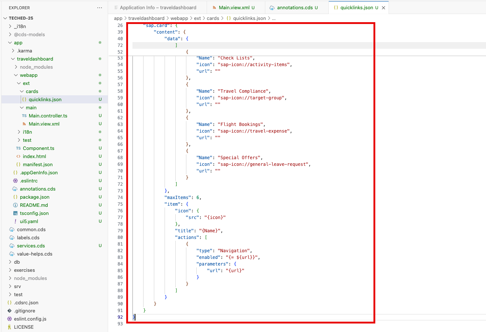

> [!NOTE]
> The manifest above defines a List card. `sap.app` supplies identity and descriptive metadata (id, titles, version, keywords). `sap.ui` declares UI5 as the technology and sets the base icon. Under `sap.card`, `type: List` selects the renderer; the `header` block defines the caption plus a navigation action. In `content.data.json` we inline static items (each with name, icon, url) consumed by the card. `maxItems` limits rendered entries and the `item` template maps JSON fields to the row icon and title while declaring a navigation action that is only enabled if a URL value is present. No controller code is required—everything is driven by the manifest.

Now we'll add the **Quick Links** card to the grid container. Insert the following Card snippet inside the `<f:GridContainer>` tags in the Main.view.xml file:

```
<w:Card manifest="./ext/cards/quicklinks.json" class="sapUiTinyMargin" id="quicklinksCard">
    <w:layoutData>
        <f:GridContainerItemLayoutData columns="3" id="quicklinksCardLayoutData" />
    </w:layoutData>
</w:Card>
```

> [!NOTE]
> The snippet embeds the Quick Links Integration Card into the custom page. `w:Card` is the UI5 Integration Card widget; its `manifest` attribute points to the local card descriptor we just created. The `sapUiTinyMargin` CSS class adds outer spacing so that cards don’t touch. Inside, `GridContainerItemLayoutData columns="3"` tells the surrounding `GridContainer` to allocate three grid columns to this card (influencing width/responsiveness) while other cards can use different spans. No additional view controller logic is needed—rendering, data, and actions are driven entirely by the manifest.


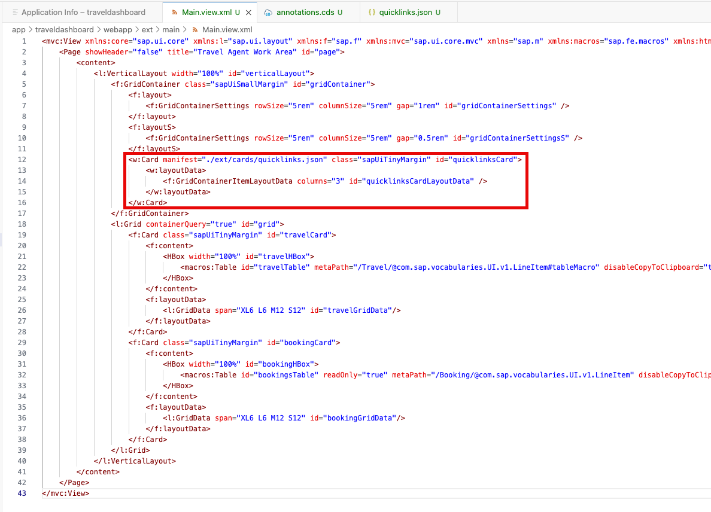

Refresh the page to see the updates. The Quick Links card should now be visible in the grid container:

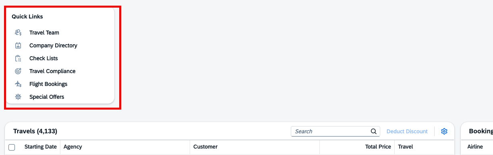

Next you add a News card (List-style presentation) showing travel-related headlines with title, description, and icon. Here the data is hardcoded to illustrate card structure. A production implementation would bind to an external REST or OData feed, enabling dynamic updates without code changes.

Create a `news.json` file in the `app/traveldashboard/ext/cards` directory and populate it with the following content: [news.json](news.json).

Insert the following News Card snippet above the **Quick Links** Card definiton in the Main.view.xml file:

```
<w:Card manifest="./ext/cards/news.json" class="sapUiTinyMargin" id="newsCard">
    <w:layoutData>
        <f:GridContainerItemLayoutData rows="4" columns="5" id="newsCardLayoutData" />
    </w:layoutData>
</w:Card>
```

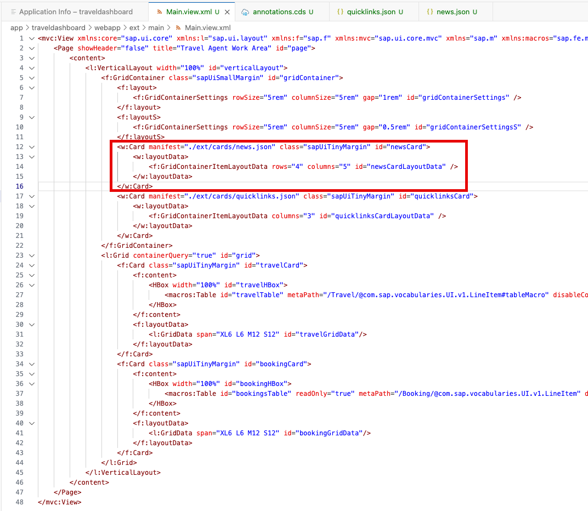

Finally, following the same steps, we will add two more Cards to display Bookings by Date and Bookings by Airline. 

> [!NOTE]
> The Bookings by Date and Bookings by Airline cards use the Analytical card type. Each card issues an OData V4 request that performs server-side grouping and aggregation plus ordering—demonstrating how OData query options (`$apply`, `$orderby`, `$top`) let you shape analytical datasets declaratively. This minimizes frontend logic: the card consumes already aggregated measures and dimensions for chart rendering.
> 
> OData request of the bookings by date card:<br>
`/processor/Booking?$orderby=FlightDate desc&$apply=groupby((FlightDate),aggregate(BookingUUID with countdistinct as countBookings))&$skip=0&$top=6`
> 
> For more information you can read through the OData documentation: https://www.odata.org/documentation/ and CAP documentation: https://cap.cloud.sap/docs/advanced/odata. Note, that not all OData capabilities are implemented in all frameworks.

Create two new JSON files in the `webapp/ext/cards` folder named `bookingsbydate.json` and `bookingsbyairline.json`, and add the following content to each file respectively:

**bookingsbydate.json**
```
{
	"_version": "1.14.0",
	"sap.app": {
		"id": "traveldashboard.cards.bookingsbydate",
		"type": "card",
		"title": "Bookings by Date",
		"subTitle": "",
		"applicationVersion": {
			"version": "1.0.0"
		},
		"shortTitle": "Bookings by Date",
		"info": "Card displaying bookings by date",
		"description": "Card displaying bookings by date",
		"tags": {
			"keywords": [
				"Bookings"
			]
		}
	},
	"sap.ui": {
		"technology": "UI5",
		"icons": {
			"icon": "sap-icon://column-chart"
		}
	},
	"sap.card": {
		"type": "Analytical",
		"header": {
			"title": "Bookings by Date"
		},
		"content": {
			"data": {
				"request": {
					"url": "/processor/Booking?$orderby=FlightDate desc&$apply=groupby((FlightDate),aggregate(BookingUUID%20with%20countdistinct%20as%20countBookings))&$skip=0&$top=6"
				},
				"path": "/value"
			},
			"chartType": "timeseries_line",
			"chartProperties": {
				"plotArea": {
					"dataLabel": {
						"visible": true
					}
				},
				"timeAxis": {
					"title": {
						"visible": false
					}
				},
				"valueAxis": {
					"title": {
						"visible": false
					}
				},
				"title": {
					"visible": false
				}
			},
			"dimensions": [
				{
					"name": "Date",
					"value": "{FlightDate}",
					"dataType":"date"
				}
			],
			"measures": [
				{
					"name": "Bookings",
					"value": "{countBookings}"
				}
			],
			"feeds": [
				{
					"uid": "valueAxis",
					"type": "Measure",
					"values": [
						"Bookings"
					]
				},
				{
					"uid": "timeAxis",
					"type": "Dimension",
					"values": [
						"Date"
					]
				}
			]
		}
	}
}
```

**bookingsbyairline.json**
```
{
	"_version": "1.33.0",
	"sap.app": {
		"id": "traveldashboard.cards.bookingsbyairline",
		"type": "card",
		"title": "Bookings by Airline",
		"subTitle": "",
		"applicationVersion": {
			"version": "1.0.0"
		},
		"shortTitle": "Bookings by Airline",
		"info": "Card displaying bookings by airline",
		"description": "Card displaying bookings by airline",
		"tags": {
			"keywords": [
				"Bookings"
			]
		}
	},
	"sap.ui": {
		"technology": "UI5",
		"icons": {
			"icon": "sap-icon://line-chart"
		}
	},
	"sap.card": {
		"type": "Analytical",
		"extension": "./ChartExtension",
		"header": {
			"title": "Bookings by Airline"
		},
		"content": {
			"chartType": "Donut",
			"chartProperties": {
				"legendGroup": {
					"layout": {
						"position": "bottom"
					}
				},
				"plotArea": {
					"dataLabel": {
						"visible": true
					}
				},
				"title": {
					"visible": false
				}
			},
			"data": {
				"request": {
					"url": "/processor/Booking?$orderby=countBookings%20desc&$apply=groupby((to_Carrier_AirlineID,to_Carrier/Name),aggregate(BookingUUID%20with%20countdistinct%20as%20countBookings))&$skip=0"
				},
				"path": "/value"
			},
			"dimensions": [
				{
					"name": "Airline",
					"value": "{to_Carrier/Name}"
				}
			],
			"measures": [
				{
					"name": "Bookings",
					"value": "{countBookings}"
				}
			],
			"feeds": [
				{
					"type": "Dimension",
					"uid": "color",
					"values": [
						"Airline"
					]
				},
				{
					"type": "Measure",
					"uid": "size",
					"values": [
						"Bookings"
					]
				}
			],
			"popover": {
				"active": true
			},
			"actionableArea": "Chart"
		}
	}
}
```


Insert the following two Card snippets above the **News Card** definition in the `Main.view.xml` file:

```
<w:Card manifest="./ext/cards/bookingsbydate.json" class="sapUiTinyMargin" id="bookingsByDateCard">
    <w:layoutData>
        <f:GridContainerItemLayoutData columns="4" id="bookingsByDateCardLayoutData" />
    </w:layoutData>
</w:Card>
```

```
<w:Card manifest="./ext/cards/bookingsbyairline.json" class="sapUiTinyMargin" id="bookingsByAirlineCard">
    <w:layoutData>
        <f:GridContainerItemLayoutData columns="4" id="bookingsByAirlineCardLayoutData" />
    </w:layoutData>
</w:Card>
```

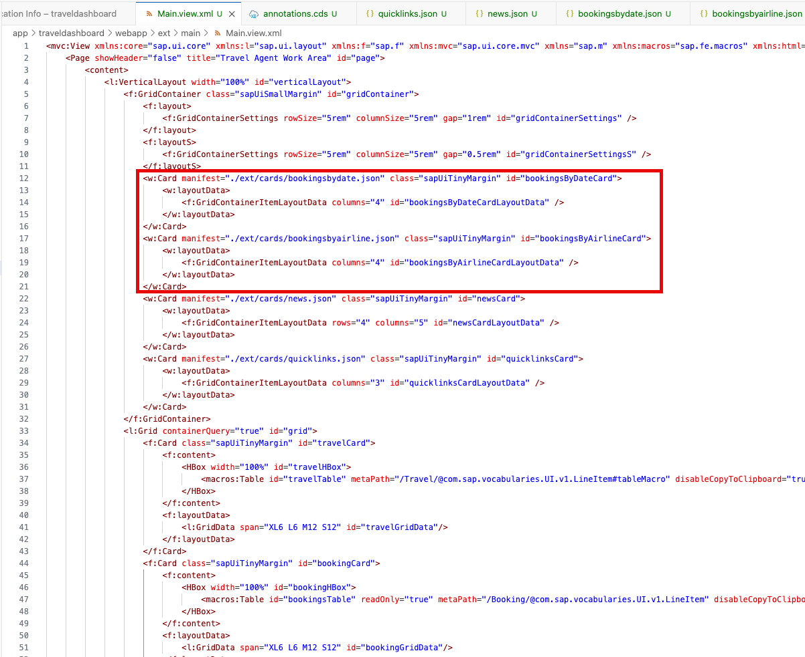

Open the application preview in the browser to see the newly added Cards displaying **Bookings by Date**, **Bookings by Airline**, **Travel News**, and **Quick Links**.

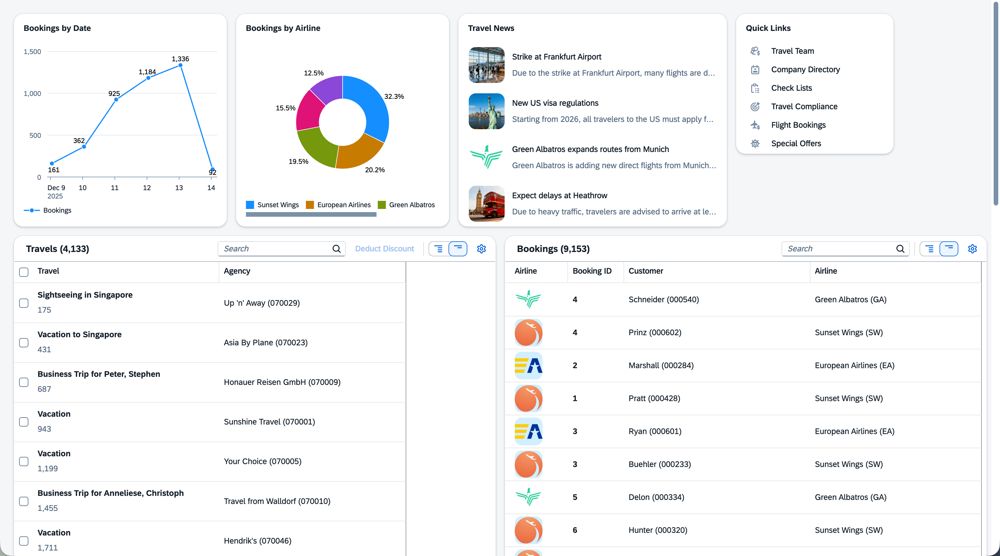

## Summary
You generated a Custom Page SAP Fiori elements app connected to a CAP OData V4 service, added a building block-based table, enriched entities with UI.HeaderInfo and LineItem annotations, configured table features and actions via the Page Editor, and integrated multiple SAPUI5 Integration Cards (List, News, Analytical) driven by manifest descriptors and OData aggregation. This demonstrates how Fiori elements building blocks and freestyle UI5 XML can be combined to rapidly deliver a flexible, data-rich, and user-friendly dashboard with minimal custom plumbing.

Continue to - [Exercise 2 - Build the Object Page](../ex2/README.md)
