# Exercise 2 - Build the Object Page

In this exercise you will create and enrich the Object Page for the Travel entity. First, you will add the page via the Page Map so that navigation from the Travel table on the dashboard (arrow icons) opens a detailed view. Then you will add grouped form sections (General Information, Prices, Dates) followed by a bookings table section—establishing a clear, maintainable layout and preparing the page for advanced flexible programming model extensions later.

## Exercise 2.1 - Create the Object Page

Begin by creating an Object Page for Travel through the Page Map. Fiori elements automatically links the Travel table on the dashboard to this page (arrow navigation), enabling drill-down to detailed information without manual wiring.

1. Navigate to the **Application Information** page to open the page map. Click the **Open Page Map** button.
Note: If the Application Information page is not open, right-click on the application root (`app/traveldashboard`) in the project explorer and select **Open Application Information**.
2. In the Page Map, click on the **+** icon next to the `pages` node to add a new page.

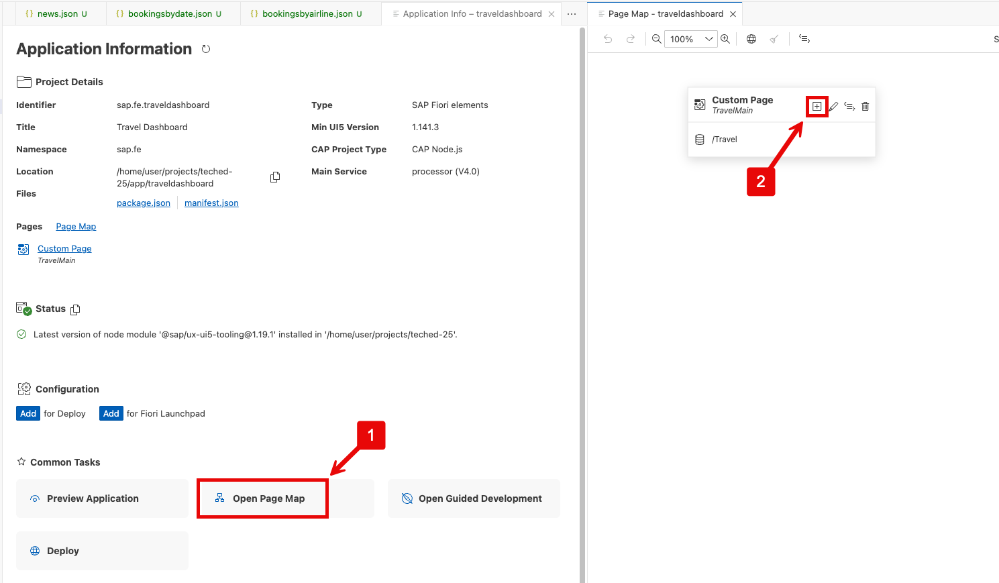

Select **Object Page** with a Navigation setting of `Travel`. Click **Add**.

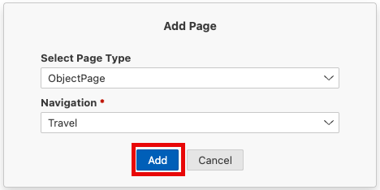

Open the application preview to see that some arrows are displayed on the Travel Dashboard page. Click on one of the arrows to navigate to the Object Page.

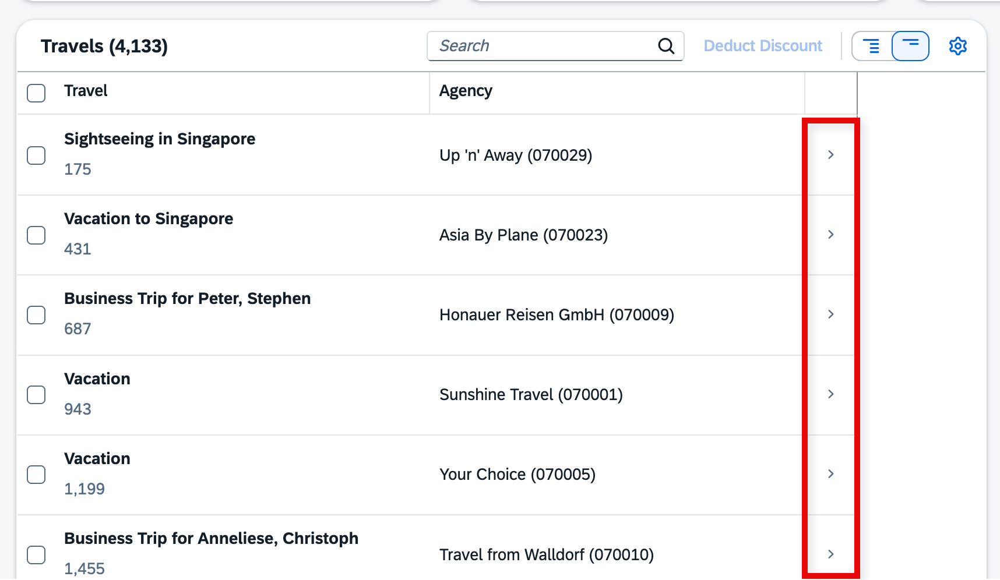

Aside from a header, the Object Page is empty. The title and subtitle are bound to what was defined in the `UI.HeaderInfo` annotation. 

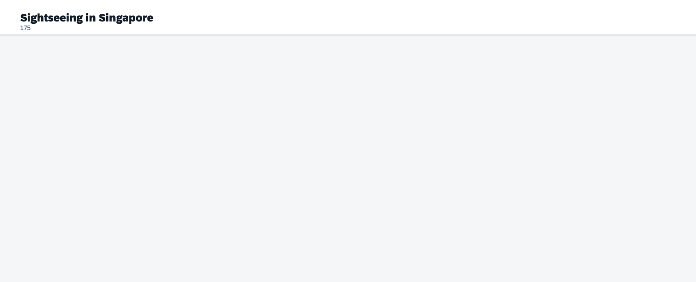

## Exercise 2.2 - Add a Form Section to the Object Page

Here you add a grouped form section to present key travel attributes (identifiers, status, agency, customer) in a structured, readable block rather than a flat list.

### Exercise 2.2.1 - Create General Information Group and Form Section
To edit the Object Page, return to the Page Map and click the **Configure Page** icon (pencil) next to **Object Page** to open the **Page Editor**.

To add a new section to the Object Page, click on the **+** icon next to **Sections** in the Page Editor. Select **Add Group Section** from the dropdown.

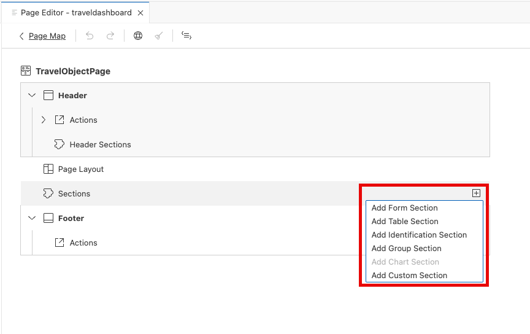

Choose `General Information` as the label and click **Add**.

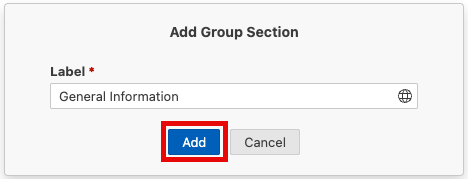

To add a subsection to the newly created section, click on the **+** icon next to **Subsections**. Select **Add Form Section** from the dropdown.

Choose `General Information` as the label again, and click **Add**.

To add fields to the subsection, click on the **+** icon next to **Fields** in the page editor. Select **Add Basic Fields** from the dropdown.

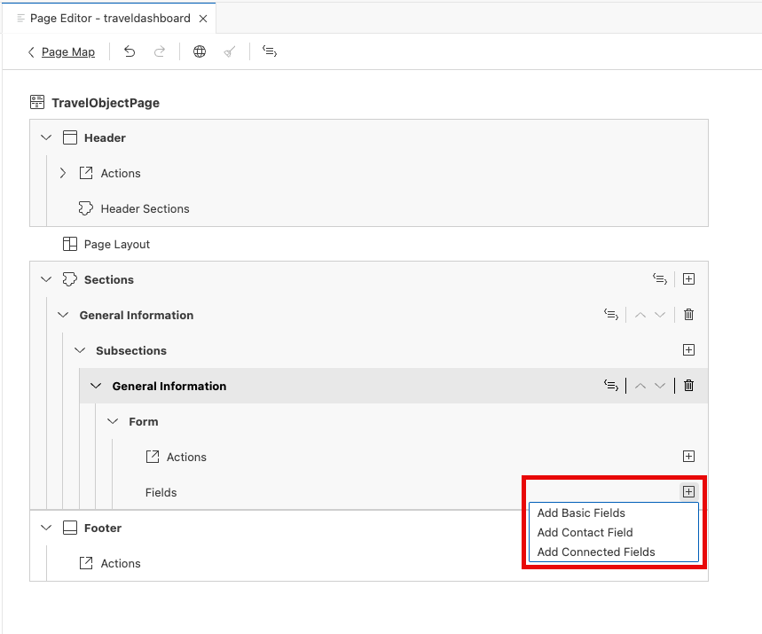

In the dialog, select the following fields in the following order to add to the subsection. Select the fields and click **Add**.
- `Travel ID`
- `Description`
- `TravelStatus_code`
- `to_Agency/AgencyID`
- `to_Customer/CustomerID`

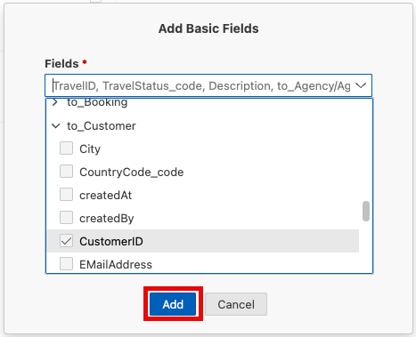

Return to the application preview and refresh the **Object Page** to see the added fields displayed in the General Information section.

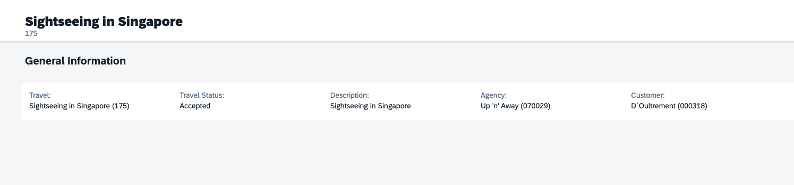

### Exercise 2.2.2 - Add Prices and Dates Form Sections
Next we will add another section to display **Prices**. Return to the Page Editor and click on the **+** icon next to **Subsections**. Select **Add Form Section** from the dropdown. 

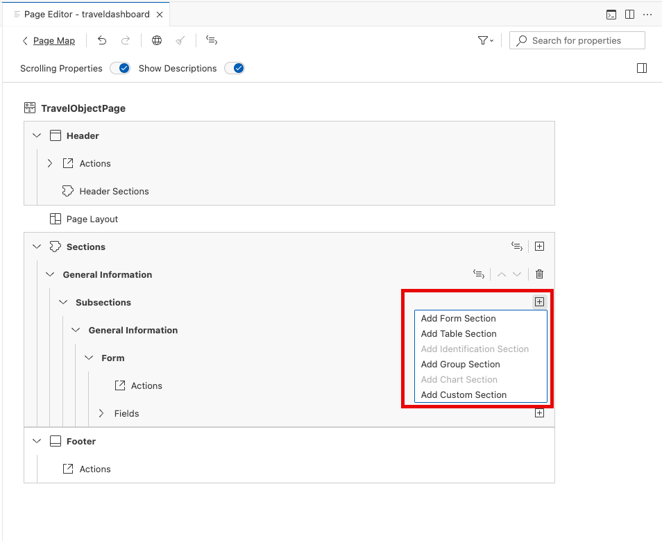

Choose `Prices` as the label and click **Add**.

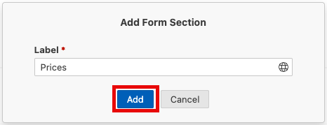

As with the **General Information** section we will add some **Basic Fields**.

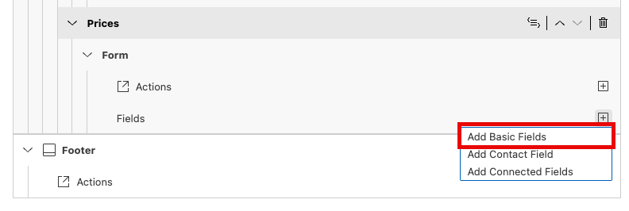

In the dialog, select the following fields in the following order to add to the subsection. Select the fields and click **Add**.
- `BookingFee`
- `TotalPrice`
- `CurrencyCode/code`

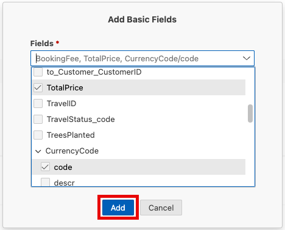

Return to the application preview and refresh the **Object Page** to see the added fields displayed in the Prices section.

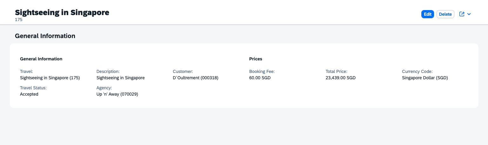

Next we will add a section to display some important **Dates** relating to the Travel. Add another **Form Section** in the same way as before, but this time label it `Dates` and add the following fields in the following order:

- `BeginDate`
- `EndDate`

Refresh the application preview to see the added fields displayed in the Dates section.

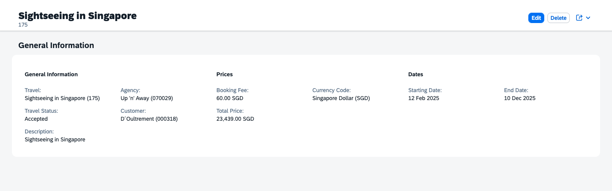

Best practice: Organize forms into logical groups (General Information, Prices, Dates) to improve scannability, support accessibility, and simplify future personalization instead of putting all fields into one large undifferentiated section.

## Exercise 2.3 - Add a Table Section to the Object Page

In this exercise, you will add a table to display booking data on the Object Page using guided development, and then transform it into a custom section with table building blocks. Page Map is an alternative for this functionality, but we used Guided Development here to meet the learning goal of tool awareness.

### Add Table Using Guided Development

Open the command palette by Navigating to **View > Command Palette** (or with Windows: `Ctrl+Shift+P` Mac: `Cmd+Shift+P`). Search for and select **Fiori: Open Guided Development**.

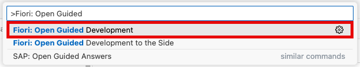

In the Guided Development panel, search for and select **Add a New Section to an Object Page**.

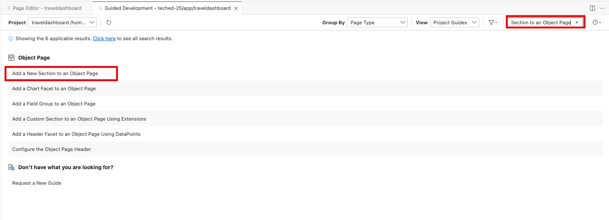

Click **Start Guide** to begin the guided development.

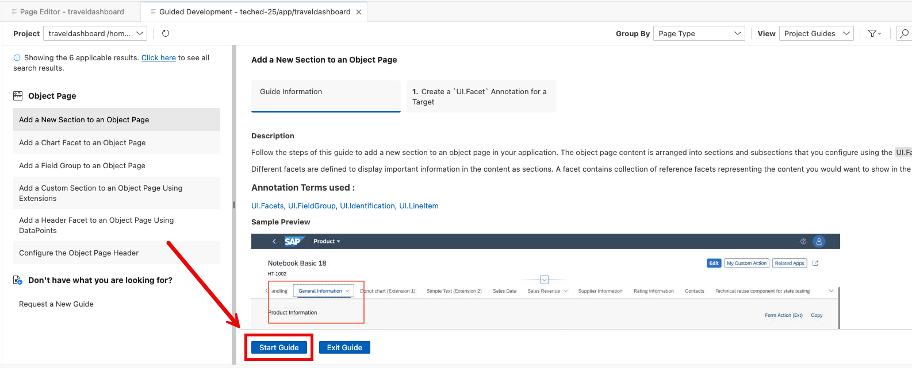

1. Under **Service and Entity Parameters** select the following configurations:
- **CDS File**: `app/traveldashboard/annotations.cds`
- **Service**: `TravelService`
- **Entity**: `Travel`

2. Under **New Section Parameters** select the following configurations:
- **Label:** `Bookings`
- **ID:** `bookings`
- **Annotation Term**: `@UI.LineItem`
- **Annotation Path**: `to_Booking/@UI.LineItem`

3. Click **Insert Snippet** to add the section to the Object Page.

As we have chosen `to_Booking/@UI.LineItem` the table definition for the bookings table card on the dashboard gets reused. In case there should be a separate table definition define an additional `UI.LineItem` annotation with a qualifier.

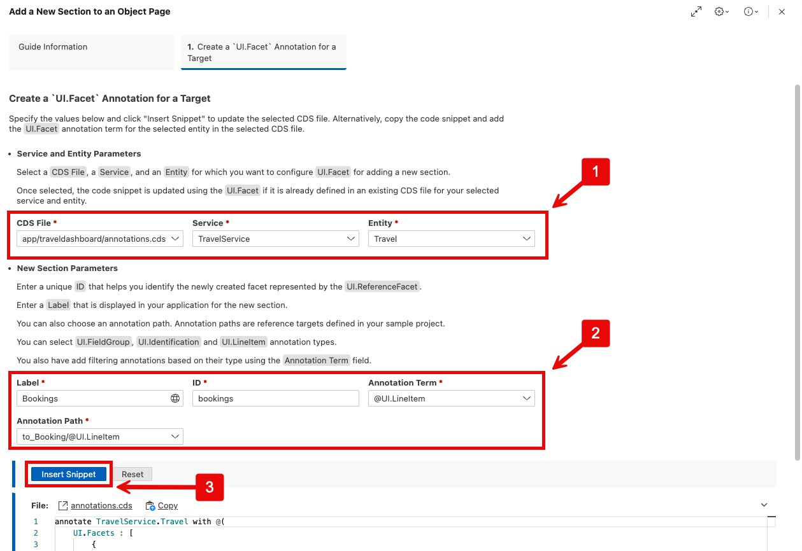

Return to the application preview and refresh the **Object Page** to see the newly added **Bookings** section with a table displaying booking data.

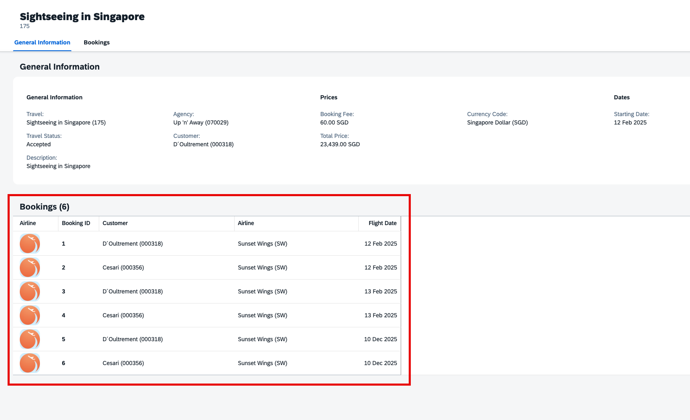

Take a few minutes to explore other Guided Development topics. Each guide produces ready-to-use annotation or XML snippets and enforces consistent patterns, letting you scale the page without hand‑coding boilerplate. Familiarity with these guides accelerates later enhancements (e.g., adding side effects, custom filters, adaptation options) and reduces maintenance.

## Summary

You added a Travel Object Page and connected navigation from the dashboard automatically via the Page Map. You structured the page with three logical form sections (General Information, Prices, Dates) to improve readability and accessibility. Using Guided Development you inserted a Bookings table section reusing the existing `UI.LineItem` annotation (`to_Booking/@UI.LineItem`), demonstrating annotation-driven reuse; a qualifier could isolate a different column set if needed. The result is a clean, extensible Object Page foundation ready for future enhancements (actions, custom facets, analytical sections) with minimal manual coding.

## Do you have some time left?
We have a bonus exercise that you can do to deepen your knowledge - [Exercise 3 - Use the Flexible Programming Model on the Object Page](../ex3/README.md)
