# Bonus Exercise 3 - Use the Flexible Programming Model on the Object Page

In this exercise you will apply the SAP Fiori flexible programming model to an Object Page: adding custom sections (e.g. filter bar + table, geo map), and preparing for controller extensions to inject custom logic beyond pure metadata-driven rendering. This shows how to incrementally extend a standard Object Page with freestyle UI while preserving Fiori elements consistency.

## Exercise 3.1 - Add a Custom Section with Geo Map

In this section you will add a geo map custom section to visualize flight routes. First, take a look at the SAP Fiori development portal’s custom section sample to learn how it works: [Custom Sections in Object Page](https://ui5.sap.com/test-resources/sap/fe/core/fpmExplorer/index.html#/topic/floorplanObjectPage/customSection)

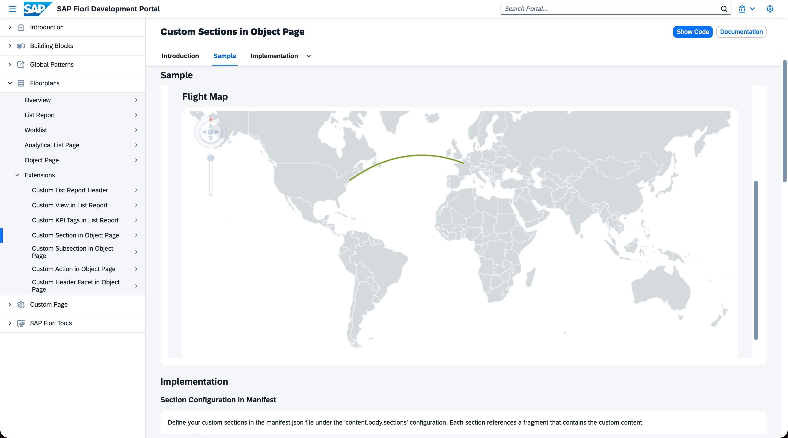

Navigate to the **Application Information** page to open the page map. Click the **Open Page Map** button.
Note: If the Application Information page is not open, right-click on the application root (`app/traveldashboard`) in the project explorer and select **Open Application Information**.

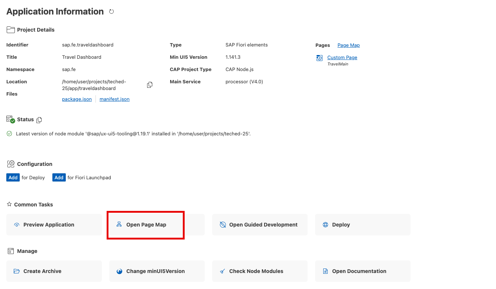

In the Page Map, click on the **Configure Page** icon (pencil) next to **Object Page** to open the **Page Editor**.

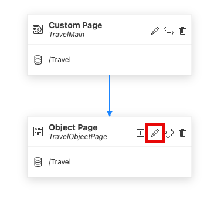

To add a new section to the Object Page, click on the **+** icon next to **Sections** in the Page Editor. Select **Add Custom Section** from the dropdown.

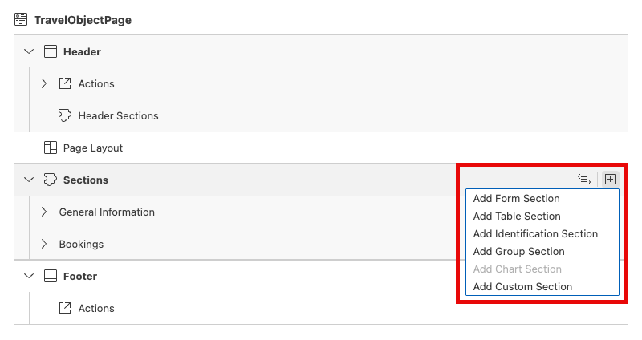

Configure the custom section with the following settings, leaving other configurations as they are. Click **Add** when done.
- **Title**: `Flight Map`
- **Fragment Name**: `FlightMap`
- **Anchor Section**: `Bookings (ID: bookings)`

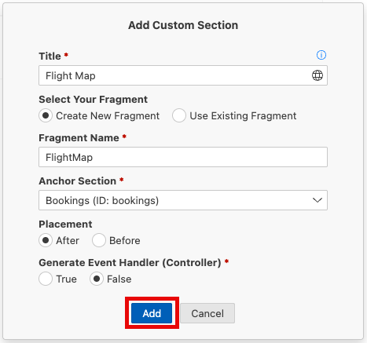

Click **Edit Source Code** for the newly created Flight Map section.

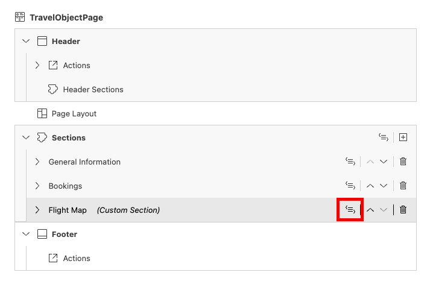

Replace the existing code with the following snippet:

```
<core:FragmentDefinition
          xmlns:core="sap.ui.core" xmlns="sap.m"
          xmlns:vbm="sap.ui.vbm" height="100%"
          displayBlock="true">

    <vbm:AnalyticMap id="vbi" width="100%" initialPosition="0;30;0"
                     initialZoom="0" height="600px">
        <vbm:vos>
            <vbm:Routes items="{to_Booking}" id="routes">
                <vbm:Route position="{to_Flight/to_Connection/FlightRoute}" id="route"
                           color="{to_Flight/to_Connection/FlightRouteColor}" linewidth="3"
                           routetype="Geodesic"/>
            </vbm:Routes>
        </vbm:vos>
    </vbm:AnalyticMap>

</core:FragmentDefinition>
```


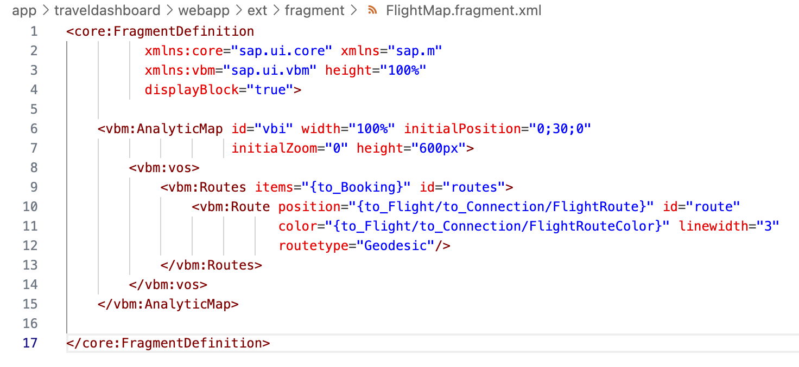

> [!NOTE]
> The code above defines a custom section for the Object Page using an XML fragment. It utilizes the `AnalyticMap` control from the SAP UI5 library to display flight routes visually. The `Route` elements within the `Routes` aggregation are bound to the flight route data from the bookings, allowing for dynamic rendering of the map based on the underlying data model.

Open the application preview and refresh the **Object Page** to see the added Flight Map section displaying flight routes.

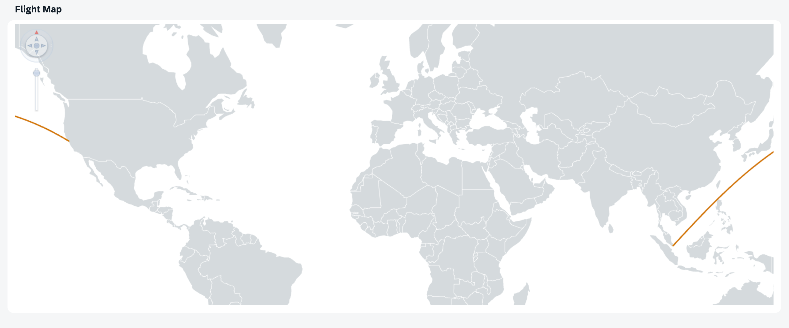

## Exercise 3.2 - Add columns for destination and departure airports
Now a user can see the flight route(s) but can't see the actual departure and destination airports in the bookings table. This should be changed now. Return to the Page Map and expand the ***Bookings*** table. Click the +-button next to ***Columns*** and select ***Add Basic Columns***.

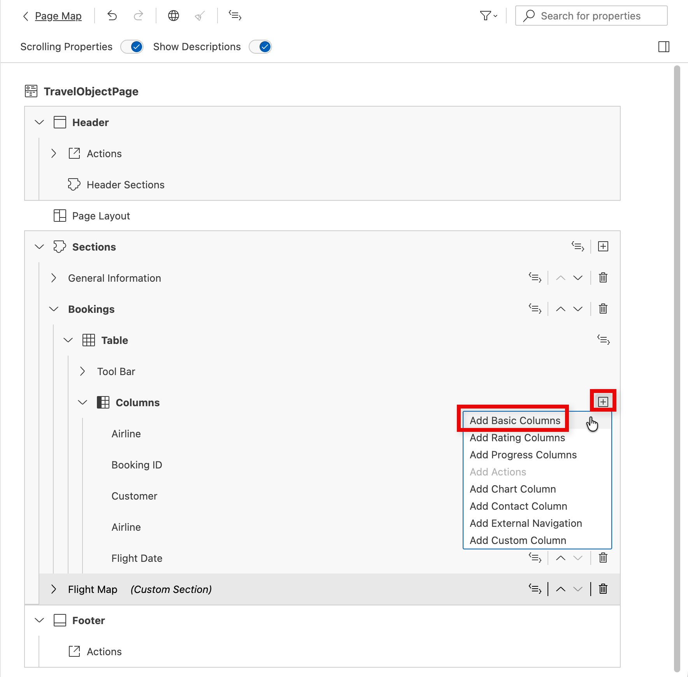

In the ***Columns*** dropdown expand ***to_Flight → to_Connection → DepartureAirport*** and select ***Name***. Then go one level up and expand ***Destination Airport*** and select ***Name***.

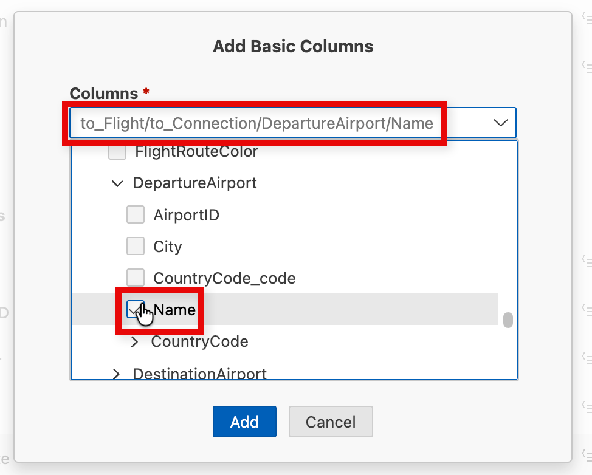

Once both airport names were added, the label should be adjusted, as both properties have the label "Name". Click on the column name to open the tools pane on the right. There you can overwrite the label. Set it to ***Departure*** for the departure airport and to ***Destination*** for the destination airport.

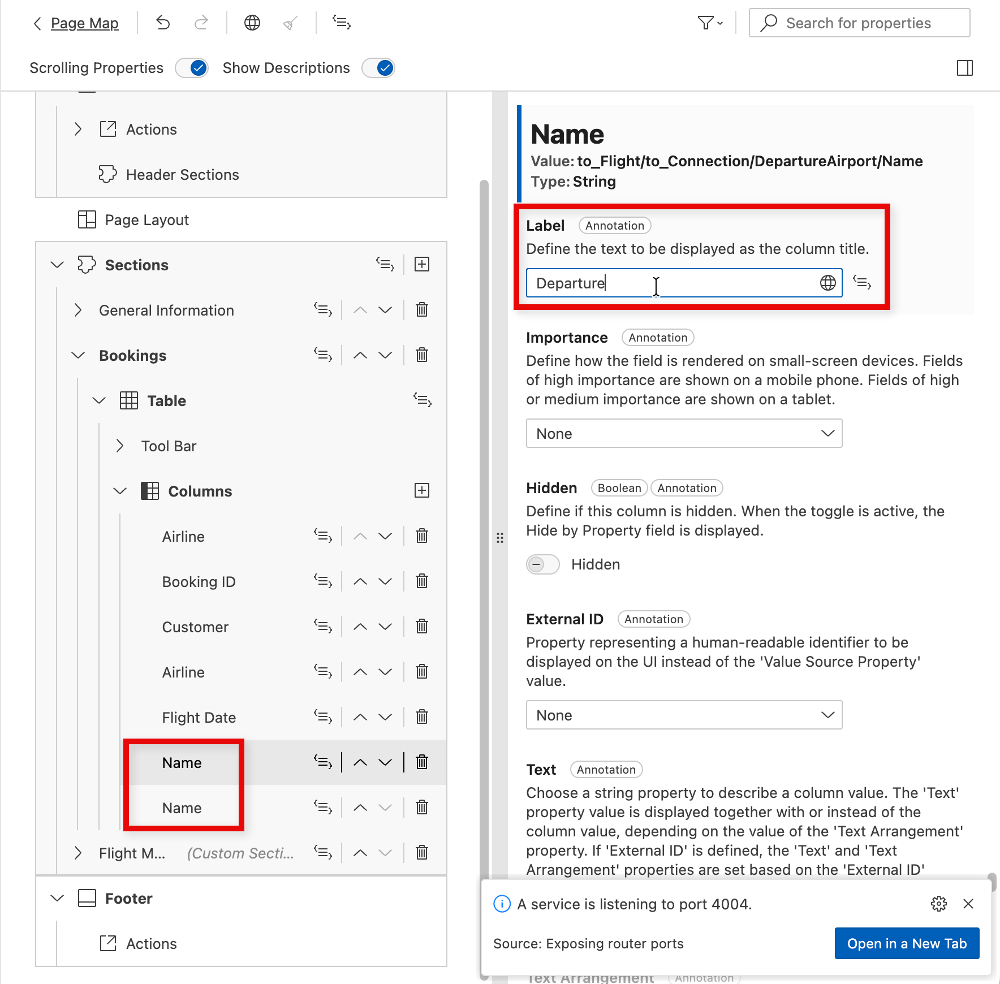

Head back to the app preview to see the two columns in the table. Now a user can relate to the flight map.

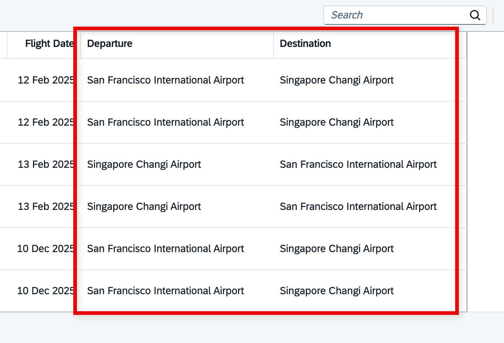

## Exercise 3.3 - Use Building Blocks in a Custom Section on the Object Page

When a related entity (like Bookings) has many records, users need quick ways to slice the dataset (e.g. by flight date or booking status) without leaving the Object Page. Instead of building a freestyle filter bar manually you can reuse Fiori elements building blocks (FilterBar + Table) inside a custom section. This exercise shows that extension points still benefit from metadata-driven building blocks, keeping code light while delivering consistent UX and feature parity with template sections.

### Exercise 3.3.1 Prepare Bookings Section
Open the ***Page Map*** and the travel object page. Click on the delete button at the ***Bookings*** section.

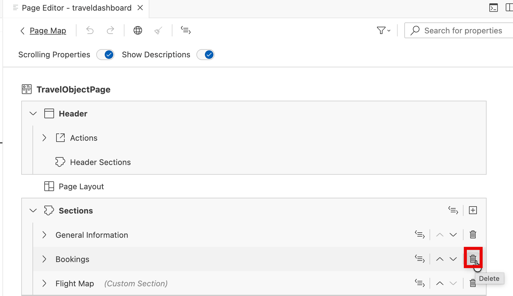

Now click the +-button in the ***Sections*** row to add an additional custom section.

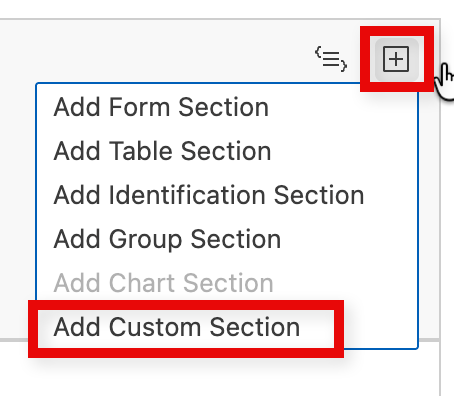

Enter the data as shown in the following screenshot.

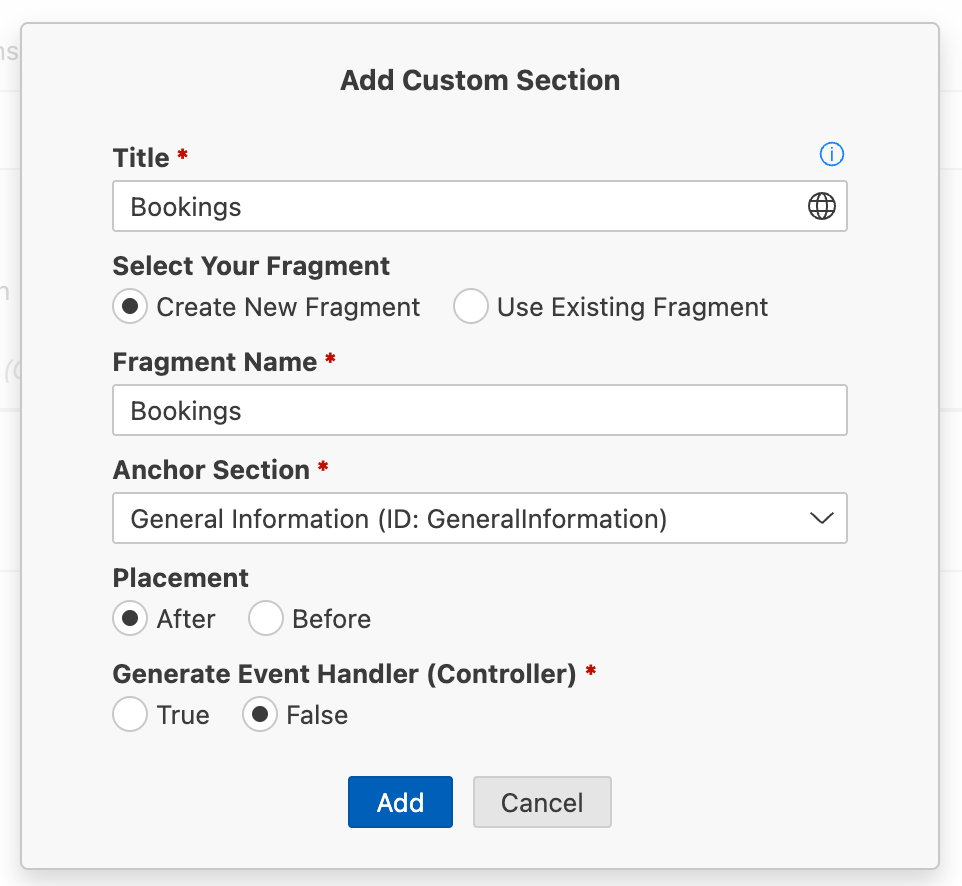

As the bookings section was deleted the anchor for the flight map section vanished, indicated through a yellow highlighting. Click on the section name ***Flight Map*** to open the tools pane on the right. At ***Anchor*** select ***Bookings (ID: Bookings)***.

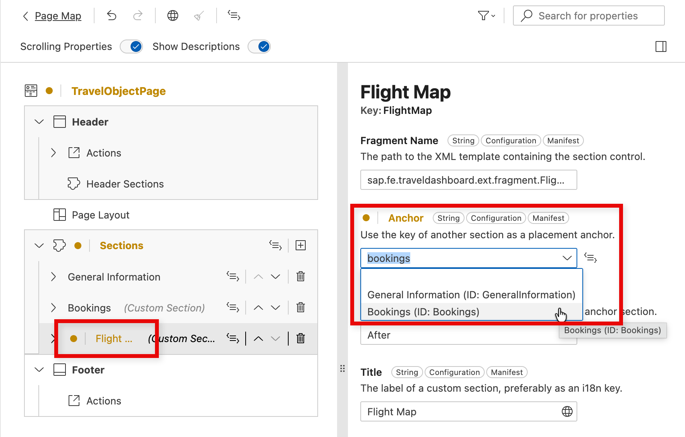

Now we want to add the filter bar building block to our custom section.

Before doing so, please open the [SAP Fiori Development Portal](https://ui5.sap.com/test-resources/sap/fe/core/fpmExplorer/index.html#/buildingBlocks/filterBar/filterBarDefault) in a new browser tab again. Navigate to ***Building Blocks > Filter Bar*** to get familiar with the filter bar building block before implementing it in your application.

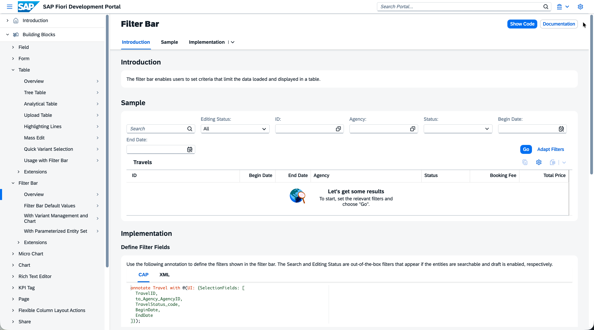

### Exercise 3.3.2 Add Building Blocks
In the page map expand the ***Bookings*** custom section and click on the +-button at ***Building Blocks***. Use ***Add Filter Bar***.

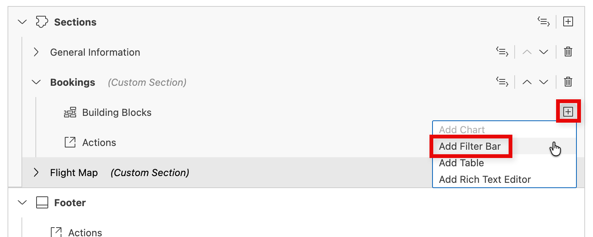

In the dialog enter the data as shown in the following screenshot.

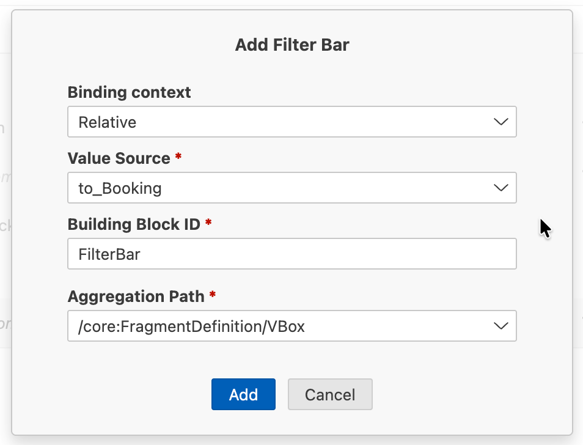

Repeat the steps to add the table building block. When clicking the +-button at ***Building Blocks*** use ***Add Table***.

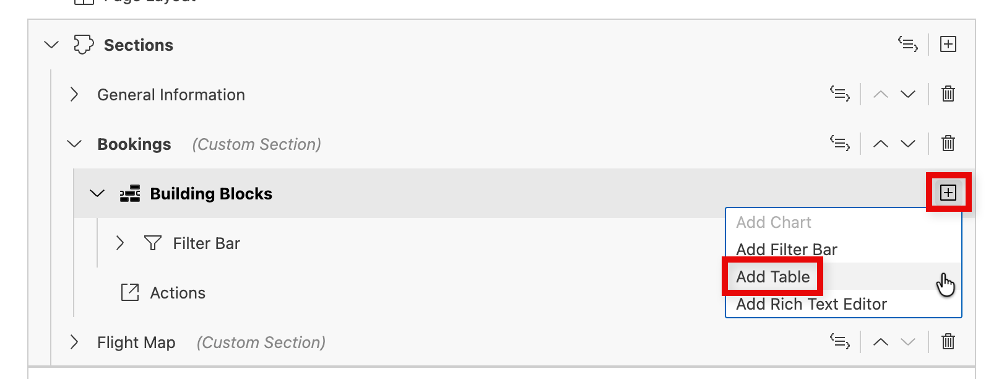

In the dialog enter the data as shown in the following screenshot.

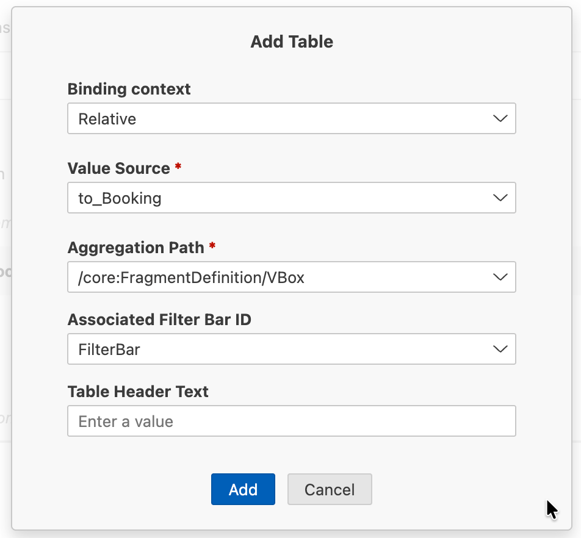

### Exercise 3.3.3 Adjust Bookings Fragment & Filters
Let's take a look at the XML fragment which got created. Click on the code button at the table or custom section.

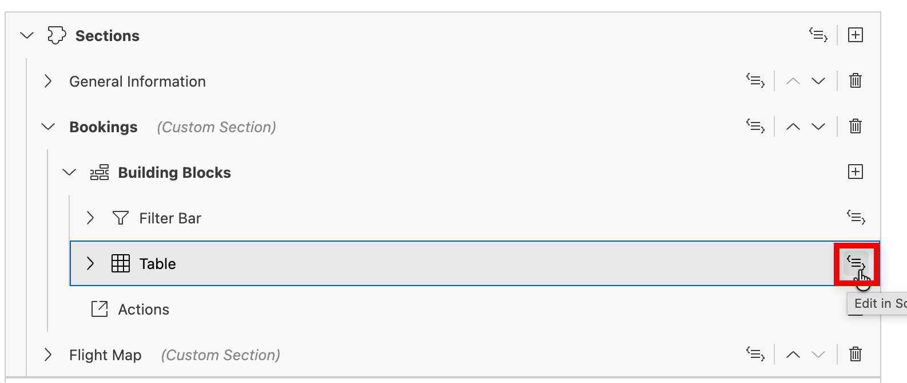

The fragment content should look like the following:

```
<core:FragmentDefinition xmlns:core="sap.ui.core" xmlns="sap.m" xmlns:macros="sap.fe.macros">
    <VBox>
        <Text text="Bookings"/>
        <macros:FilterBar id="FilterBar" metaPath="to_Booking/@com.sap.vocabularies.UI.v1.SelectionFields#filterBarMacro"/>
        <macros:Table id="Table" metaPath="to_Booking/@com.sap.vocabularies.UI.v1.LineItem#tableMacro" filterBar="FilterBar"/>
    </VBox>
</core:FragmentDefinition>
```

Notice in the table building block's metaPath, which refers to the data source and annotations, there is a `#tableMacro` suffix to the LineItem annotation. This is a qualifier with which multiple annotations of the same kind can be specified. E.g. multiple table views. When you open `app/traveldashboard/annotations.cds` you will see SAP Fiori tools also added an empty LineItem annotation. 

```
UI.LineItem #tableMacro : [
],
```

In this case we still want to use the LineItem annotation which we used before. Therefore return to `Bookings.fragment.xml` and remove `#tableMacro` from the table's metaPath.

Also, a text control `<Text text="Bookings"/>` was initially added once the custom section got created. As it is not needed in this case remove it from the fragment.

> [!TIP]
> Design tip: In custom sections (or pages) always align content using standard layout containers (e.g. `VBox`, `HBox`, `Grid`, `FlexibleColumnLayout`) and apply predefined spacing classes (`sapUiSmallMargin*`, `sapUiTinyMargin`, `sapUiNoMargin`) instead of hardcoded inline styles. This preserves visual consistency, improves responsiveness, and makes later theming or accessibility tuning easier. Collaborate with your UX designer to validate hierarchy, spacing, and semantic grouping.


To insert a margin between the filter bar and table, add the following class to the filter bar building block: `class="sapUiSmallMarginBottom"`

Eventually the fragment content should be as follows:

```
<core:FragmentDefinition xmlns:core="sap.ui.core" xmlns="sap.m" xmlns:macros="sap.fe.macros">
    <VBox>
        <macros:FilterBar class="sapUiSmallMarginBottom" id="FilterBar" metaPath="to_Booking/@com.sap.vocabularies.UI.v1.SelectionFields#filterBarMacro"/>
        <macros:Table id="Table" metaPath="to_Booking/@com.sap.vocabularies.UI.v1.LineItem" filterBar="FilterBar"/>
    </VBox>
</core:FragmentDefinition>
```

When a filter bar building block is connected to a table building block a developer can decide whether table data should be loaded automatically or only when the user presses the Go-button. In this case we want the table to automatically load data. To do so return to the ***Page Map***. Click on the ***Filter Bar*** building block to open the tools pane on the right. Go to ***Live Mode*** and choose ***True***.

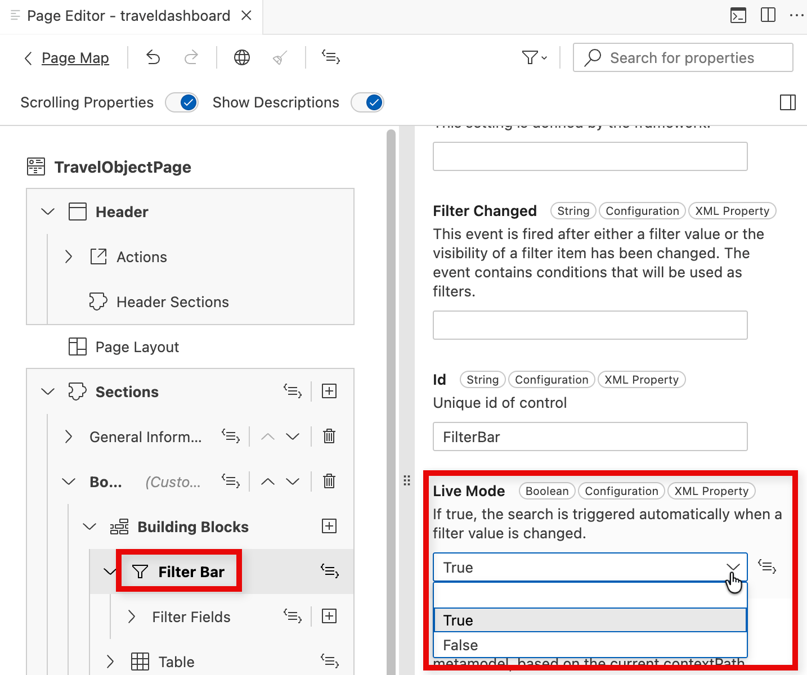

In order to add filter fields to the filter bar click on the +-button in the ***Filter Fields*** row.

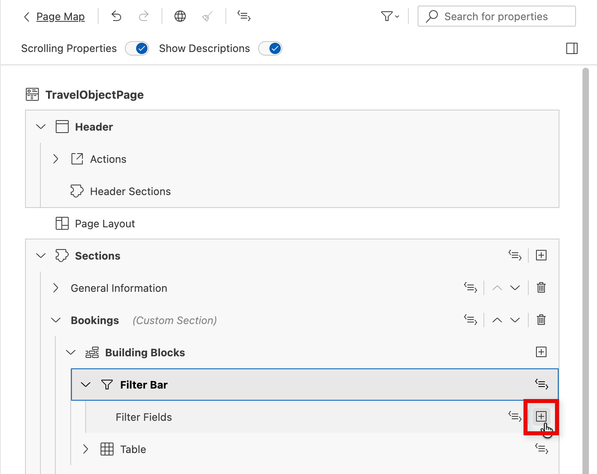

The user should have the default filters for flight data and booking status. Therefor select ***FlightDate*** and ***BookingStatus_code*** in the dialog.

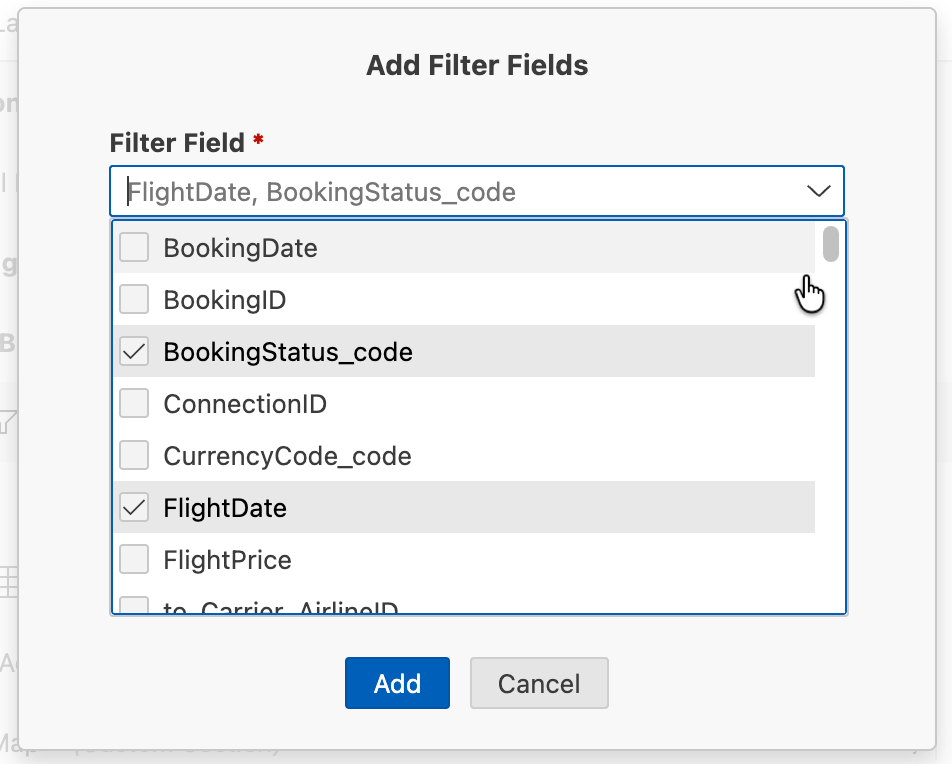

For the filter field, we will now enable the usage of semantic date values, such as ***Today*** or ***Last Week***, by applying annotation ***FilterRestrictions.AllowedExpressions*** as described in the [documentation](https://ui5.sap.com/#/topic/fef65d03d01a4b2baca28983a5449cf7).
Please copy the Code snippet below and paste it on the exact position that is shown in the picture in `app/traveldashboard/annotations.cds` (should roughly be around line number 178):

```
    Capabilities : {
      FilterRestrictions : {
        FilterExpressionRestrictions :
          [{
              Property : 'FlightDate',
              AllowedExpressions : 'SingleRange'
          }]
      }
    },
```

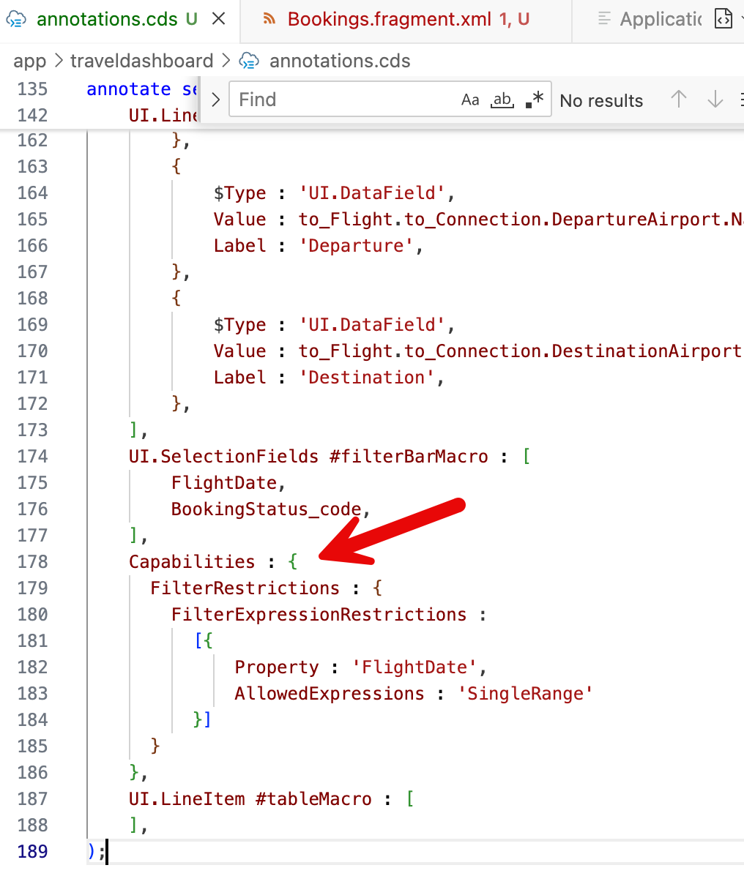

Switch to your preview tab to see the latest changes to your app. If you can't see the latest changes please reload your browser window.

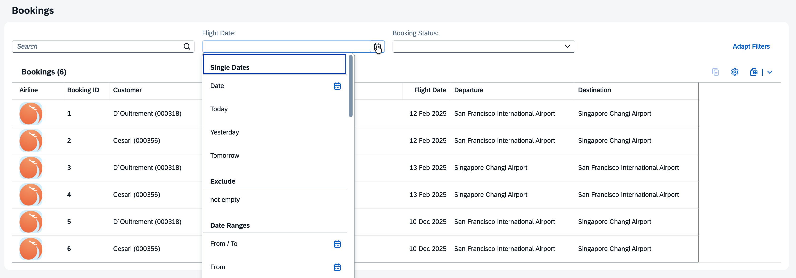

## Exercise 3.4 - Use a Controller Extension on the Object Page

SAP Fiori elements also provides various controller extensions to fine-tune the behaviour of your app. This can be in the area of edit flows/action handling, routing, navigation, etc.  Please open the [SAP Fiori Development Portal](https://ui5.sap.com/test-resources/sap/fe/core/fpmExplorer/index.html#/controllerExtensions/guidanceControllerExtensions) in a new browser tab again. Navigate to  **Floorplans > Extensions** to get familiar with the available controller extensions before implementing one in your application.


### Exercise 3.4.1 Implement Controller Extension
Launch the **Application Information** page and click on **Open Page Map**. Click **Add Controller Extension** for the TravelsObjectPage.

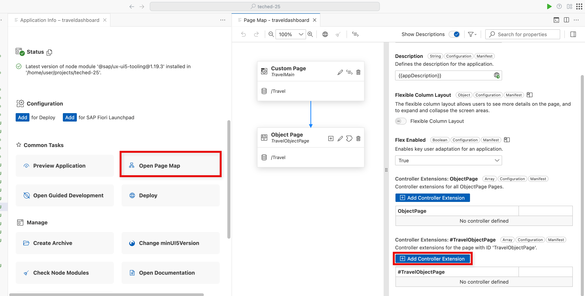

Name the controller **"OPExtend"** and click **Add**.

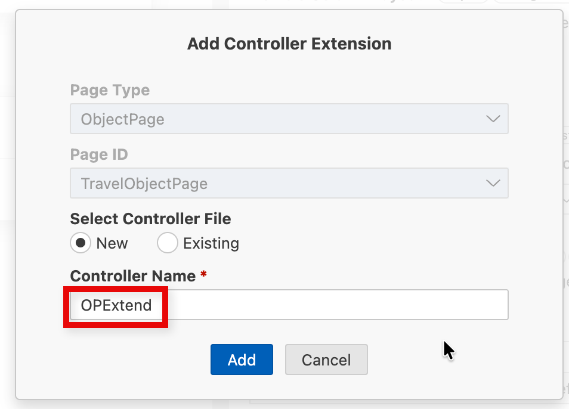

Click **Edit in source code** to add some custom controller configurations.

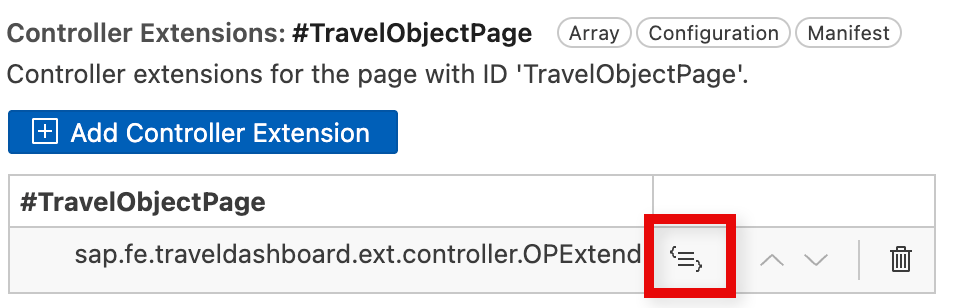

Replace the source code inside **OPExtend.controller.ts** with the following code snippet:

```
import ControllerExtension from 'sap/ui/core/mvc/ControllerExtension';
import ExtensionAPI from 'sap/fe/templates/ObjectPage/ExtensionAPI';
import type Dialog from "sap/m/Dialog";
import JSONModel from "sap/ui/model/json/JSONModel";
import Context from 'sap/ui/model/odata/v4/Context';

/**
 * @namespace sap.fe.traveldashboard.ext.controller
 * @controller
 */
export default class OPExtend extends ControllerExtension<ExtensionAPI> {
	static overrides = {
		/**
		 * Called when a controller is instantiated and its View controls (if available) are already created.
		 * Can be used to modify the View before it is displayed, to bind event handlers and do other one-time initialization.
		 * @memberOf sap.fe.traveldashboard.ext.controller.OPExtend
		 */
		onInit(this: OPExtend) {
			const data = {
				text: ""
			};
			const dialogModel = new JSONModel(data);
			this.base.getView().setModel(dialogModel, "dialog");

		},
		editFlow: {
			onBeforeEdit: function (this: OPExtend, parameters: {context: Context}): Promise<void> {
				if(parameters?.context.getProperty("TotalPrice") > 5000) {
					return this.openDialog("Do you want to edit this travel request?");
				} else {
					return Promise.resolve();
				}
			},
		}
	}

	public async openDialog(text: string, fnAction?: () => void): Promise<void> {
		const dialogModel = this.base.getView().getModel("dialog") as JSONModel;
		const data = dialogModel.getData();
		data.text = text;
		dialogModel.setData(data);
		// Use building blocks in an XML fragment using the loadFragment method from the SAP Fiori elements ExtensionAPI
		const approveDialog = (await this.base.getExtensionAPI().loadFragment({
			id: "myAcceptDialog",
			name: "sap.fe.traveldashboard.ext.fragment.Dialog",
			controller: this
		})) as Dialog;
		return new Promise((resolve, reject) => {
			approveDialog.getBeginButton().attachPress(() => {
				approveDialog.close();
				if (fnAction) {
					fnAction();
				}
				resolve();
			});
			approveDialog.getEndButton().attachPress(() => {
				approveDialog.close().destroy();
				reject();
			});
			approveDialog.attachAfterClose(() => {
				approveDialog.destroy();
				reject();
			});
			approveDialog.open();
		});
	}
}


```

> [!NOTE]
> Explanation: This controller extension (`OPExtend`) plugs into the Object Page edit flow via the `editFlow.onBeforeEdit` hook. During initialization (`onInit`) it creates a lightweight JSON model named `dialog` used to pass dynamic text into a confirmation dialog. Before an edit starts, the extension checks the bound context's `TotalPrice`; if the amount exceeds 5000 it opens a custom dialog (loaded lazily via the ExtensionAPI `loadFragment` method) asking the user to confirm. The dialog itself is an XML fragment that uses standard UI5 controls; its begin and end buttons resolve or reject the Promise returned by `onBeforeEdit`, thereby allowing or preventing the edit. This pattern shows how to inject business validations and user interaction into otherwise metadata-driven flows without forking the template controller.

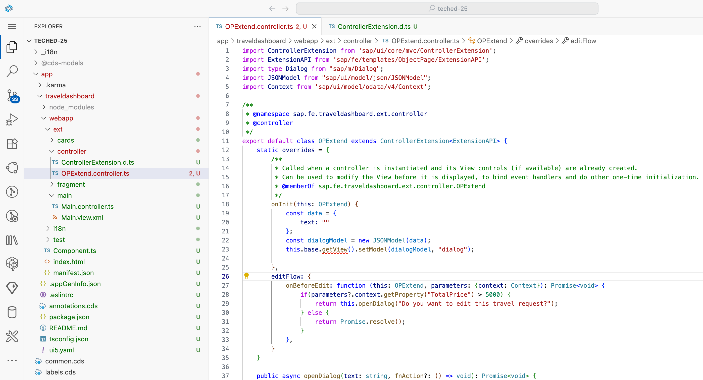

You might spot an error message in `OPExtend.controller.ts`: `Property 'getView' does not exist on type '{ getExtensionAPI(): ExtensionAPI; }'`. It is already fixed in an internal SAPUI5 version and will be published soon. To fix it in your project open `app/traveldashboard/webapp/ext/controller/ControllerExtension.d.ts`. When `import View from "sap/ui/core/mvc/View";` gets imported and `getView(): View;` gets added as shown in the code-snippet below the error will vanish as `getView` is then known.

```
/**
 * Helper to be able to define how to get the page specific extension API when writing a controller extension.
 */

declare module 'sap/ui/core/mvc/ControllerExtension' {
    import View from "sap/ui/core/mvc/View";
    export default class ControllerExtension<API> {
        static overrides: unknown;
        base: {
            getExtensionAPI(): API;
            getView(): View;
        }
    }
}
```


### Exercise 3.4.2 Create Dialog Fragment
Now it's time to create the dialog fragment that is referenced in our controller extension code. Navigate to the **fragment** folder inside the **Explorer**. Right click and click **New File...**

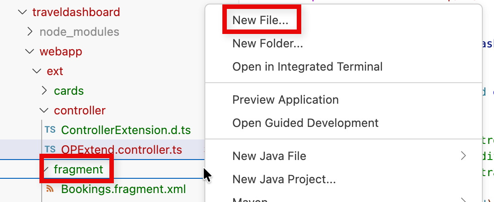

Name the file **"Dialog.fragment.xml"**. Open the file and paste in the following code snippet:

```
<core:FragmentDefinition
	xmlns="sap.m"
	xmlns:macros="sap.fe.macros"
	xmlns:l="sap.ui.layout"
	xmlns:f="sap.ui.layout.form"
	xmlns:core="sap.ui.core"
>
	<Dialog title="Confirmation" id="confirmationDialog">
		<content>
			<Text
				id="message"
				text="{dialog>/text}"
				class="sapUiSmallMarginTop sapUiSmallMarginBottom sapUiSmallMarginBeginEnd"
			/>
		</content>
		<beginButton>
			<Button id="continue" text="Continue" press="onConfirm" type="Emphasized" />
		</beginButton>
		<endButton>
			<Button id="cancel" press="onCancel" text="Cancel" />
		</endButton>
	</Dialog>
</core:FragmentDefinition>
```

Now let's test our controller extension to ensure it properly intercepts edit operation for high-value travel records. Switch to the **preview tab** in your browser to test the controller extension functionality.

Click on a travel entry with a price above 5000 to open it in the Object Page. Note, that in real-world scenarios of course the currency has to be taken into account. This was left out in this exercise for simplicity reasons. To see more data like the total price click on the ***Show more*** button in the table toolbar.

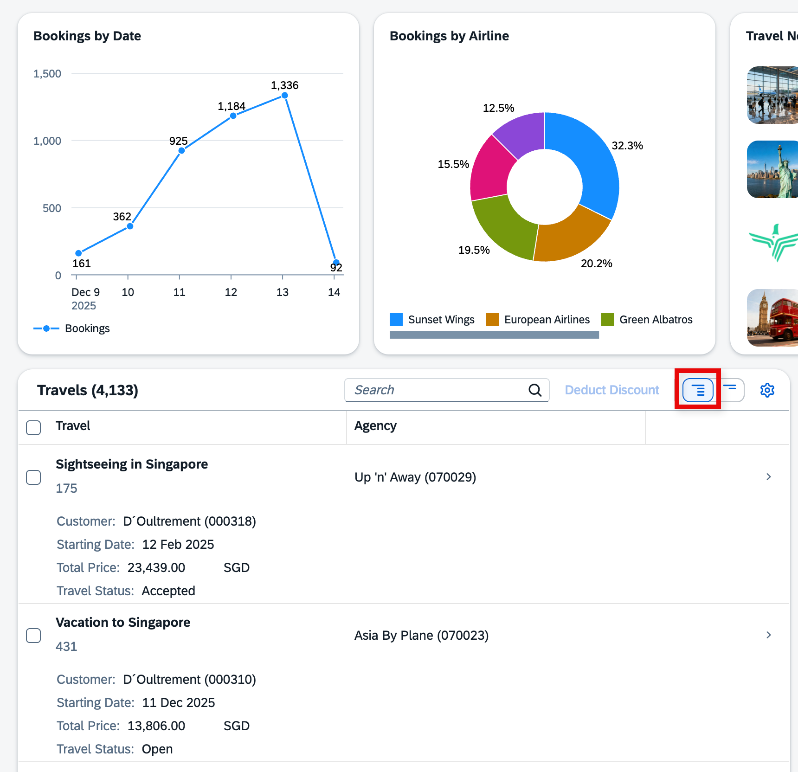

Click the **Edit** button in the top-right corner of the Object Page.

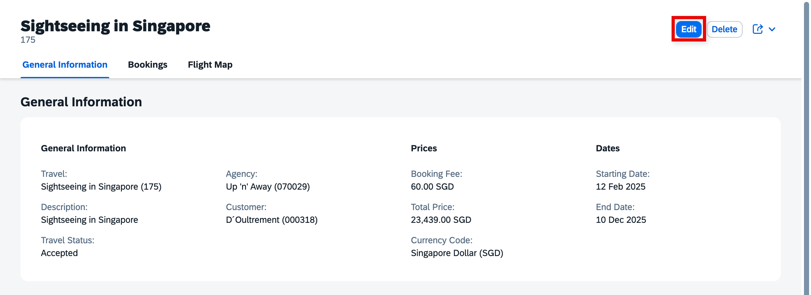

Since this travel has a price above 5000, our controller extension should trigger a dialog asking for confirmation of the edit. Click **Continue** to proceed with the edit.

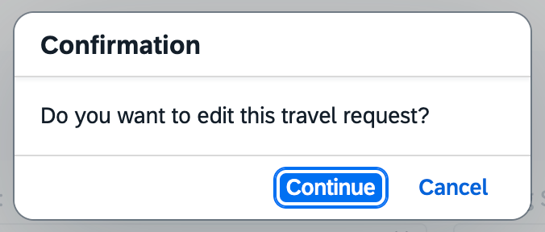

Your controller extension is now working correctly, intercepting edit operations for high-value travel records and providing the necessary business validation through custom dialogs.

## Summary

You extended a standard Object Page using the flexible programming model: first adding a geo map custom section (AnalyticMap) to visualize flight routes, then enhancing the Bookings presentation with a metadata-driven FilterBar + Table combination in a custom section for scalable filtering of large datasets. You refined annotations (selection fields, semantic date filtering via `FilterRestrictions.AllowedExpressions`) and adjusted table columns/labels for clarity (Departure vs Destination). Finally, you implemented a controller extension (`onBeforeEdit`) to inject business validation and user confirmation for high-value travel edits using a lazily loaded dialog fragment. Together these steps demonstrate how to mix Fiori elements building blocks, annotations, and targeted custom code to evolve UX without sacrificing consistency, reuse, or maintainability.

## What to do now?

If you are now fired up and want to do more, we recommend the following resources:
- Find further [tutorials, courses and blogs for SAP Fiori elements](https://ui5.sap.com/#/topic/7715a0167f4443d3a03751be3b3127d1); recommended for SAP CAP/Fiori elements is [Developing an SAP Fiori Elements App Based on a CAP OData V4 Service](https://learning.sap.com/courses/developing-an-sap-fiori-elements-app-based-on-a-cap-odata-v4-service)
- Explore the [Feature Showcase Apps and Samples](https://ui5.sap.com/#/topic/521405cc719e4e699a25366461a516cb)
